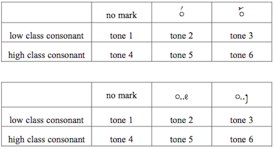

import CaptionText from '/src/components/CaptionText.astro';

Like many other Tai scripts, the Tai Viet script contains a double set of initial consonants. These mark the tone class (high or low) of the following syllable. The high form of the consonant indicates tone 4, 5 or 6; the low form indicates tone 1, 2 or 3. Historically, this has been the only method of representing tone in the script. As checked syllables (those ending /p/, /t/, /k/, or /ʔ/) can only take tone 2 or tone 5, selecting the appropriate consonant form is sufficient for defining the tone of those syllables. The tone of unchecked syllables has traditionally been determined from the context. 

In recent years, additional means of tone marking have been introduced. Tai Dam speakers in the United States have adopted Lao tone marks, which are combining marks written above the initial consonant or above a combining vowel, as per the first table, below. These are used by the Song Petburi font and for SIL's Tai Heritage font. 

The Tai community in Vietnam write their own tone marks on the base line at the end of the syllable, as shown in the second table, above. Currently, both systems of tone marking are in use.

Although the languages which use the Tai Viet script are overwhelmingly monosyllabic, a small number of words have two syllables, the first syllable being unstressed. In these words, tone is not marked on the unstressed syllable. Loan words may also have more than one syllable, and similarly do not mark tone.

<CaptionText text='Reference: Brase, Jim. &#x201C;Proposal to encode the Tai Viet script in the UCS&#x201D;, 2007 p. 7'/>

<CaptionText text='This article formerly appeared on ScriptSource.'/>