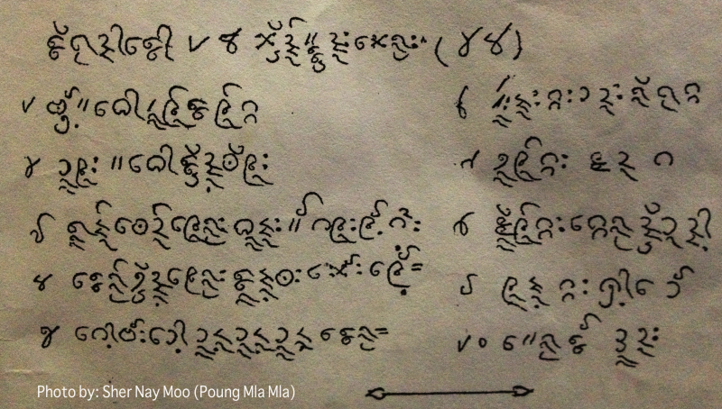

import CaptionText from '/src/components/CaptionText.astro';
import Attribution from '/src/components/Attribution.astro';

<CaptionText text='Reference: The writing is in the Eastern Pwo Karen language.'/>

This image was taken by Sher Nay Moo (Poung Mla Mla) in 2013. But the writing is already old, maybe around 1960.

Further information about the Leke script:

- [Omkoi Pwo Karen Phonology and Orthography][audra-phillips]
- [A Brief Outline on the Traditional Background of the The Lehkai (Ariya) Religious Sect and its Leit-Hsan Wait][karen-heritage]

<Attribution type='Article' copyyears='2013' copyholder='Sher Nay Moo (Poung Mla Mla)' author='' license='CC BY-SA 3.0' licenseUrl='https://creativecommons.org/licenses/by-sa/3.0/'/>

<CaptionText text='This article formerly appeared on ScriptSource.'/>

[karen-heritage]: https://www.burmalibrary.org/docskaren/Karen%20Heritage%20Web/pdf/Lehkai.pdf
[audra-phillips]: https://www.researchgate.net/publication/255595122_Omkoi_Pwo_Karen_Phonology_and_Orthography