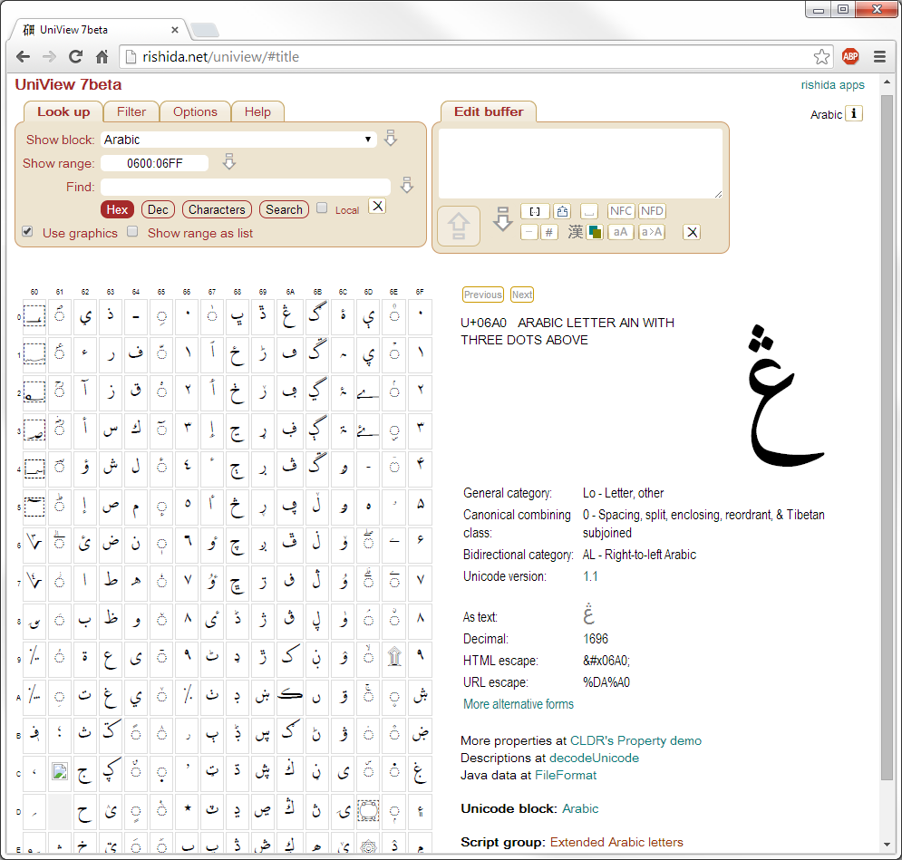
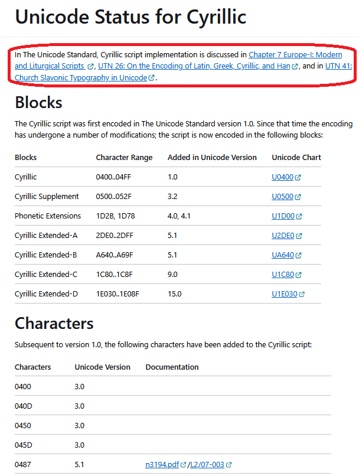

import CaptionText from '/src/components/CaptionText.astro';
import Attribution from '/src/components/Attribution.astro';

For the casually interested, browsing among the thousands of characters available in the Unicode standard can be a fascinating experience. For those implementing writing system components, finding exact details about a particular character or set of characters can be essential to a successful design. 

Fortunately there are a variety of tools available for browsing the Unicode characters and their properties, and this article discusses a number of them.

Each tool has strengths and weaknesses, so you may not find one tool that does all you need. 

### Unicode website

The starting place — the horse's mouth as it were — for all Unicode character information is the [Unicode website][uni-home] itself. There you can browse the [latest version][uni-latest] of the standard as well as many of the archived previous versions. The [text chapters of the standard][uni-corespec] and the [charts][uni-charts] are generally provided as PDFs, while other textual items such as the annexes and technical reports are provided as html pages. Most of the details about a particular character, however, are encoded in data files known as the [Unicode Character Database][uni-ucd] or _UCD_. 

Don't be frightened off by the term _database_ — all the files in the UCD are _human readable_ text files so you can open them directly in your favorite plain text editor. Even so, there are over 60 separate files in the UCD (or, if you prefer XML, the same information is contained in a handful of structured XML files), so finding your way around in this forest can be difficult. And the primary UCD file contains over 24,000 lines of text — and that is not counting the 300,000 lines describing unified Han characters that are elsewhere in the UCD. Whew!

This is where Unicode character browsers help out: they provide easy ways to find and study the characters that interest you.

### Unibook


The Unicode Consortium itself provides a useful character browser called [Unibook][unibook]. The original (and continuing) purpose of this program was to print the code charts used to publish the Unicode standard, but it has evolved into a general purpose and useful Unicode character browser. In the Unibook browser window you can click on any character cell and a popup will give additional details (user configurable) about that character. You can also copy any character to the clipboard, thereby providing character-picker functionality.

Unibook's sophisticated search facilities can find and highlight characters based on up to four criteria including Unicode property values, character names, font coverage, and even user-supplied property files. Other advanced capabilities include Bidi and Line Break algorithm demos, legacy character set views, and flexible font selections.

One of Unibook's main strengths is that it runs locally and does not require an internet connection. Unfortunately it has two weaknesses: it is Windows only, and can display glyphs only for those characters for which you have fonts installed on your system. Nonetheless it has been a mainstay of Unicode developers for years.

### UniView

On his website, Richard Ishida has published a number of useful Unicode-related tools and resources. Relevant to this topic, Richard's [UniView][uniview] page is a very capable and useful character browser. Displayed at left is again the Arabic block with one particular character having been selected.

By default UniView displays server-generated graphics for each character, meaning you don't have to have the fonts on your local machine. There is an option to display characters as text rather than graphics, in which case you would need to configure the desired fonts into your browser settings.

In addition to browsing the Unicode character database, UniView can serve as a character picker and as a clipboard viewer, allowing one to see exactly what Unicode characters are in the clipboard text.

### FileFormat.Info

One of the links on UniView leads us to another useful Unicode resource at [FileFormat.Info][fileformat.info]. At left is the information FileFormat.Info displays for a single Arabic character. One of the strengths of this site is that it shows how the character would be expressed in various Unicode Encoding Forms and programming languages. Another useful aspect of this site is that you can put the character you want directly in the URL for example:

```
http://www.fileformat.info/info/unicode/char/067b/index.htm
```

Thus you could set up quick-searches in your browser to go directly to the character.

### Finding when a character was added to Unicode

One way to find this kind of information is in the [DerivedAge.txt][uni-derivedage] file that is part of the Unicode Character Database.

Another place to find useful information is by Script.

Click on **Scripts Index** under the **Scripts & Languages** subject on the left sidebar.

Click on "Cyrillic" (or whatever script you are interested in)

Search for "Unicode Status" (all scripts _should_ have a "Unicode Status" page). You will need to click on **Full Unicode status for Cyrillic**.

At the top of the [resulting page](/scrlang/unicode/cyrl-unicode) you'll first see a link to the Unicode documentation for the script. In this case, Cyrillic is discussed in Chapter 7, and there are two Unicode Technical Notes which also discuss Cyrillic.



Next you'll see the various blocks for that script. For Cyrillic there are seven blocks containing Cyrillic characters. You can see when a block was added to Unicode. (That doesn't actually mean that all the characters in that block were added, maybe just a few characters were encoded initially.) It also includes a link to the Unicode codecharts (under "Documentation") for that block.

The second table includes many of the characters that were encoded after the script was first encoded. This table is sorted by USV (Unicode Scalar Value). It will show you what version a particular character was added. Also, if the Unicode proposal is available online, we've linked to the Unicode proposal for a character in case you would find it helpful to know why a character was added to Unicode. For example, :usv[0487]{usv char name} was added to Unicode 5.1 and link to the Unicode proposal. From the proposal, I learn how the character compares with :usv[0311]{usv char name} and :usv[0483]{usv char name}. There are examples of this character in the figures of the proposal.

<Attribution type='Article' copyyears='2012-2026' copyholder='SIL Global' author='Bob Hallissy and Lorna Evans' license='CC BY-SA 3.0' licenseurl='https://creativecommons.org/licenses/by-sa/3.0/'/>


<CaptionText text='This article formerly appeared on ScriptSource.'/>

[uni-home]: https://home.unicode.org/
[uni-latest]: https://www.unicode.org/versions/latest/
[uni-corespec]: https://www.unicode.org/versions/latest/core-spec/
[uni-charts]: http://www.unicode.org/charts/
[uni-derivedage]: https://unicode.org/Public/UNIDATA/DerivedAge.txt
[uni-ucd]: https://www.unicode.org/ucd/
[unibook]: https://www.unicode.org/unibook/
[uniview]: https://r12a.github.io/uniview/
[fileformat.info]: https://www.fileformat.info/info/unicode/

