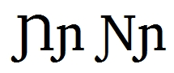

import CaptionText from '/src/components/CaptionText.astro';

U+019D/U+0272 are used in a few orthographies around the world. There are several styles for the uppercase which could lead to confusion as to whether the different styles are actually different characters. The Unicode Consortium considers them to be glyph variants. This entry does not include information on which variant a language uses. 

<CaptionText text='This article formerly appeared on ScriptSource.'/>