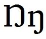

import CaptionText from '/src/components/CaptionText.astro';

A few languages use the capital eng which is based on the shape of the lowercase eng. However, this version does not have a descender, the hook is on the baseline. With the possible exceptions of Lamnso' [lns] and Tedaga [tuq], this appears to be an older style with most languages moving toward using the shape with a descender.

<CaptionText text='This article formerly appeared on ScriptSource.'/>