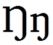

import CaptionText from '/src/components/CaptionText.astro';

The majority of languages in Africa and Papua New Guinea (where the eng is used in their orthography) use the capital eng which is based on the shape of the lowercase eng. The most common style is where the eng has a descender. Earlier usage tended to be on the baseline.

<CaptionText text='This article formerly appeared on ScriptSource.'/>