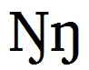

import CaptionText from '/src/components/CaptionText.astro';

Some languages use the capital eng which is based on the capital N with a hook descender on the right leg.

<CaptionText text='This article formerly appeared on ScriptSource.'/>