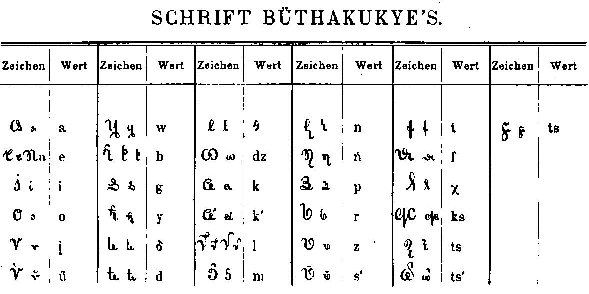

import CaptionText from '/src/components/CaptionText.astro';
import Attribution from '/src/components/Attribution.astro';

Alphabet used during the XIX century in Albania. Probably the one created by Naum Veqilharxhi, cited by Robert Elsie

<Attribution type='Image' copyyears='' copyholder='' author='' license='Public Domain' licenseUrl='' source='Archive.org' sourceurl='https://archive.org/stream/dasbuchderschri00faulgoog#page/n5/mode/2up'/>

<CaptionText text='This article formerly appeared on ScriptSource.'/>