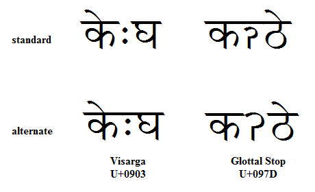

import CaptionText from '/src/components/CaptionText.astro';

The image below shows alternate forms of the Devanagari visarga and glottal stop. Both of these letters have variations with respect to the inclusion of the horizontal "clothesline."

In the case of the visarga, the horizontal line is never written in Hindi and Nepali, but several other languages prefer to include it in order to not give the appearance of a word break.

The glottal stop character is used in Limbu, where inclusion of the line is a stylistic alternate reflecting the writer's preference.

<CaptionText text='This article formerly appeared on ScriptSource.'/>