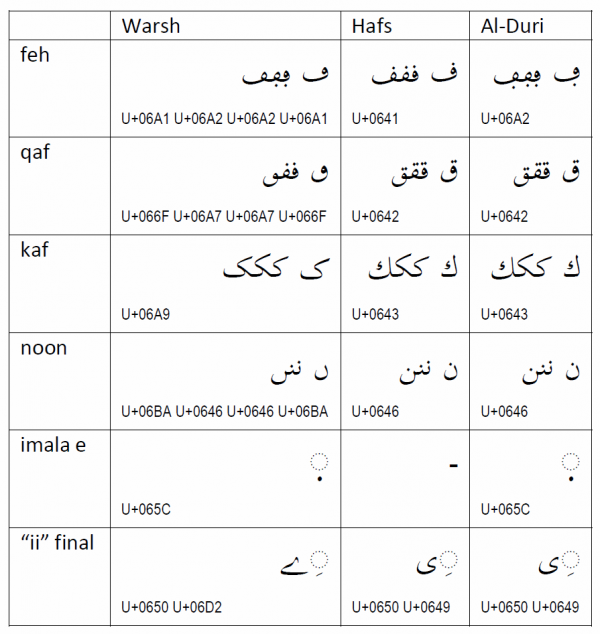
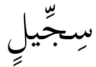
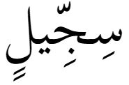

import Character from '/src/components/Character.astro';

While developing a font intended for use in West Africa it was important to support the Warsh (Warš) orthography (or reading tradition) for the Arabic script. It was somewhat of a challenge to figure out what exactly that would mean. There is not much written on Warsh. Is it character selection, alternate rendering or perhaps style of characters? It seems that all of these are involved in a Warsh orthography.

## Different or Same Characters?

In the chart below we see how Warsh behavior contrasts with two other orthographic traditions - Hafs and Al-Duri. Hafs is the most common orthographic tradition for Modern Standard Arabic. Al-Duri is used in Sudan, Central Africa and some regions of Nigeria.

For the Hafs and Al-Duri orthographies it is a simple matter of choosing a different character. For example, the Hafs "feh" requires a nukta dot above and the Al-Duri "feh" requires a nukta dot below, but the four forms are consistent. The issue becomes more complex with Warsh. For some characters (kaf, imala e and "ii" final) it is a simple matter of using another codepoint. In the Warsh orthography the isolate and final "feh", "qaf", and "noon" must be dotless. These are now supported in Unicode at <Character usv="08BB" options="usv,char,name"/>, <Character usv="08BC" options="usv,char,name"/>, and <Character usv="08BD" options="usv,char,name"/>. 

It is interesting to note that the "imala e" (<Character usv="065C" options="usv,char,name"/>) is sometimes referred to as a "warsh dot".

## Positioning

Another aspect of Warsh is that the hamza on <Character usv="0623" options="usv,char,name"/> and <Character usv="0625" options="usv,char,name"/> actually touch the alef. This kind of behavior can be programmed into the font. However, characters in the range of U+0870..U+0882 were added to Unicode. This range supports a variety of characters such as _fatha_, _kasra_, and _hamza_ touching above, below, or beside an _alef_. These character provide the needed support for Warsh. 

## Shadda plus kasra positioning

<Character usv="0650" options="usv,char,name"/> normally appears below the consonant. However, when there is a <Character usv="0651" options="usv,char,name"/> plus a _kasra_, the _kasra_ normally moves **above** the consonant (and below the _shadda_). 

There are a number of languages which do not use this behavior, the _kasra_ remains below the consonant even in the context of a _shadda_. The Warsh orthography follows this alternate behavior.

This kind of behavior should be programmed into the font.

## Are there other aspects of a Warsh orthography?

I'm sure there are other aspects of what it means to support a Warsh orthography in a font. I would be interested in hearing what they are.

