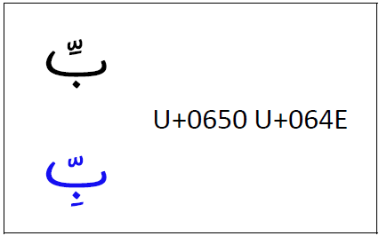
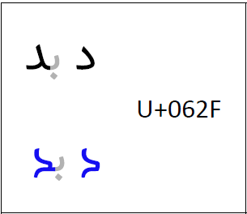
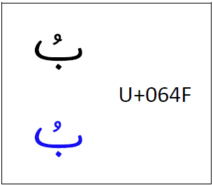

import CaptionText from '/src/components/CaptionText.astro';
import Character from '/src/components/Character.astro';

Wolof can be written in three different scripts (Arabic, Garay, and Latin). Fonts which are intended to support the Wolof language using **Arabic script** must include some different lesser-used characters as well as different design features than those designed for standard Arabic. In every case, the blue is what a Wolof font should support.

## Special characters

Wolof includes some special characters which are not used in standard Arabic. These are:

- <Character usv="0752" options="usv,char,name"/>
- <Character usv="0756" options="usv,char,name"/>
- <Character usv="075d" options="usv,char,name"/>
- <Character usv="0767" options="usv,char,name"/>
- <Character usv="08f4" options="usv,char,name"/>
- <Character usv="08f5" options="usv,char,name"/>
- <Character usv="08f7" options="usv,char,name"/>
- <Character usv="08f9" options="usv,char,name"/>
- <Character usv="08fa" options="usv,char,name"/>

The first four characters in the above list are dual-joining base characters. Next, we have five vowel marks which are required in addition to more standard vowel marks.

See [Grapheme Data for Wolof written with Arabic script](/scrlang/graphemes/wo-arab) for more information on the current orthography.

## Shadda plus kasra positioning

When a _kasra_ is used in context with the _shadda_, most Arabic fonts will move the _kasra_ up and ligate it below the _shadda_. This should not happen for Wolof support. The _kasra_ should remain below the base. 

<CaptionText text='Wolof shadda-kasra in blue.'/>

## Dal shape

The design of the _dal_ (and all related characters) in Wolof should be more squared, as shown in blue below.

<CaptionText text='Wolof dal in blue.'/>

## Damma

For <Character usv="064f" options="usv,char,name"/>, the Wolof preference is that the stroke does not completely go through the initial stroke as seen in blue.

<CaptionText text='Wolof damma in blue.'/>

## Inverted damma

Wolof requires an open style for <Character usv="0657" options="usv,char,name"/>. See [Glyph Variant for U+0657](/articlelib/g/glyph-variant-for-u-0657).

See also [What is a Warsh Orthography?](/articlelib/w/warsh-orthography) for other considerations.

