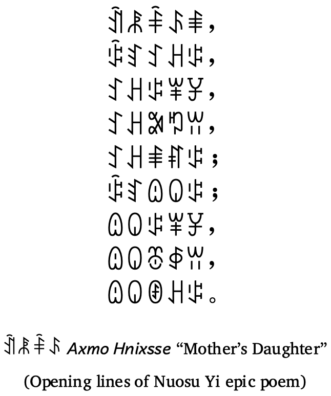

import CaptionText from '/src/components/CaptionText.astro';
import Attribution from '/src/components/Attribution.astro';

The Nuosu SIL Font is a single Unicode font for the standardized Yi script used by a large ethnic group in southwestern China. Until this version, the font was called SIL Yi.

<Attribution type='Image' copyyears='2022' copyholder='SIL International' author='' license='CC BY-SA 3.0' licenseUrl='https://creativecommons.org/licenses/by-sa/3.0/' source='Nuosu SIL Product Site' sourceurl='https://software.sil.org/nuosu/'/>

<CaptionText text='This article formerly appeared on ScriptSource.'/>