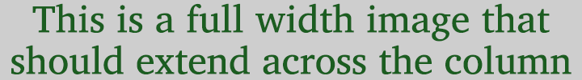

import Attribution from '/src/components/Attribution.astro';
import CaptionText from '/src/components/CaptionText.astro';

This is an intervening paragraph. The purpose of this is to test the spacing between the image and its caption, and the spacing between the caption and the next paragraph.

<Attribution 
    type="Image" 
    license="Public Domain" 
    author="Jane Doe"
    source="Website"
    sourceurl="https://example.com/image-source"
/>  

This is an intervening paragraph. The purpose of this is to test the spacing between the image and its caption, and the spacing between the caption and the next paragraph.

This is another intervening paragraph. The purpose of this is to test the spacing between the image and its caption, and the spacing between the caption and the next paragraph.

<Attribution 
    type="Image" 
    copyholder="John Doe" 
    copyurl="https://example.com/image-source"
    copyyears="2020-2024" 
    license="CC BY-SA 4.0" 
    licenseurl="https://creativecommons.org/licenses/by-sa/4.0/" 
    author="Jane Doe"
    source="Website"
    sourceurl="https://example.com/image-source"
/> 

This is another intervening paragraph. The purpose of this is to test the spacing between the image and its caption, and the spacing between the caption and the next paragraph.

<CaptionText text="This **is** a `markdown` caption." />
<Attribution 
    type="Image" 
    copyholder="John Doe" 
    copyurl="https://example.com/image-source"
    copyyears="2020-2024" 
    license="CC BY-SA 4.0" 
    licenseurl="https://creativecommons.org/licenses/by-sa/4.0/" 
    author="Jane Doe"
    source="Website"
    sourceurl="https://example.com/image-source"
/> 

This is a paragraph that might be the end of an article. References (using the CaptionText component), and Attribution for the whole article may follow.

<CaptionText text='Reference: Brase, Jim. "Proposal to encode the Tai Viet script in the UCS", 2007 p. 2' />
<Attribution 
    type="Article" 
    copyholder="John Doe" 
    copyurl="https://example.com/image-source"
    copyyears="2020-2024" 
    license="CC BY-SA 4.0" 
    licenseurl="https://creativecommons.org/licenses/by-sa/4.0/" 
    author="Jane Doe"
    source="Website"
    sourceurl="https://example.com/image-source"
/> 
<CaptionText text="This article formerly appeared on ScriptSource." />

