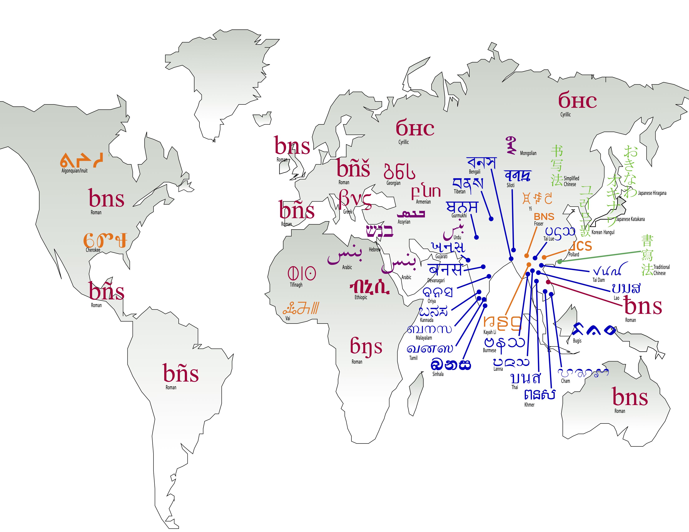

import { Badge } from '@astrojs/starlight/components';
import { Steps } from '@astrojs/starlight/components';

:::note
This is a guidance document for authors, primarily the Writing Systems Technology (WSTech) team.
:::

Page sources need to use the flavor of Markdown supported by Starlight as documented in [Authoring Content in Markdown][starlight-authoring-content]. Additional markdown reference material can be found at the [Markdown Cheat Sheet][markdown-cheat-sheet].

The following examples are intended as a reference but also to test all the elements with the site CSS. _If you use markdown elements that are not documented here please add them to this page. This enables us to adjust the CSS in the future and quickly see the impact it may have on page layout._

## Text formatting

Text can be **bold**, _italic_, ~~strikethrough~~, or `inline code`. Note that for clarity please use double asterisks for bold and single underscores for italic.

```md
Text can be **bold**, _italic_, ~~strikethrough~~, or `inline code`. Note that for clarity please use double asterisks for bold and single underscores for italic.
```

## Headings

Heading 1 is only used by the page title. Anchors are automatically generated for all headings. The heading title can be added to the page URL with a hash, replacing spaces with hyphens, removing punctuation, and making it all lowercase. A heading of 'AI use' would become `#ai-use`.

## Heading 2

### Heading 3

#### Heading 4

##### Heading 5

###### Heading 6

```md
## Heading 2

### Heading 3

#### Heading 4

##### Heading 5

###### Heading 6
```

## Lists

Lists should not have any blank lines between items. Multiple lists should be separated by a normal paragraph with blank lines before and after, otherwise they may not render correctly.

- First item
- Second item
    - Sub item
    - Another
- Third item

```md
- First item
- Second item
    - Sub item
    - Another
- Third item
```

1. First item
2. Second item
3. Third item

```md
1. First item
2. Second item
3. Third item
```

## Tables

| Syntax | Description |
| ----------- | ----------- |
| Header | Title |
| Paragraph | Text |

```md
| Syntax | Description |
| ----------- | ----------- |
| Header | Title |
| Paragraph | Text |
```
It can also be slightly simplified, without the left and right pipes:

Unicode block | Font support
------------- | ------------
C0 Controls and Basic Latin|U+0020..U+007E
C1 Controls and Latin-1 Supplement|U+00A0..U+00FF

```md
Unicode block | Font support
------------- | ------------
C0 Controls and Basic Latin|U+0020..U+007E
C1 Controls and Latin-1 Supplement|U+00A0..U+00FF
```

When text requires wrapping in cells, the relative width of columns can be somewhat adjusted by tweaking the `--- | ---` line under the header:

Unicode block | Characters | Long explanation
------------- | ---- | -----------------------------
C0 Controls and Basic Latin|U+0020..U+007E|This is a longer text to describe the basic Latin block
C1 Controls and Latin-1 Supplement|U+00A0..U+00FF|

```md
Unicode block | Characters | Long explanation
------------- | ---- | -----------------------------
C0 Controls and Basic Latin|U+0020..U+007E|This is a longer text to describe the basic Latin block
C1 Controls and Latin-1 Supplement|U+00A0..U+00FF|
```

Table columns can also be aligned using `:---:` syntax.

Left-aligned | Centered | Right-aligned 
:------------- | :------------: | -------------:
This is a longer text to describe the basic Latin block|C0 Controls and Basic Latin|U+0020..U+007E
More left-aligned text|C1 Controls and Latin-1 Supplement|U+00A0..U+00FF

```md
Left-aligned | Centered | Right-aligned 
:------------- | :------------: | -------------:
This is a longer text to describe the basic Latin block|C0 Controls and Basic Latin|U+0020..U+007E
More left-aligned text|C1 Controls and Latin-1 Supplement|U+00A0..U+00FF
```

### Image references

To place an image on a page use this format, and do not leave AltText blank:

```md

```

Here is an example of an image reference:


```md

```

You can reference images wider than 720 pixels wide and they will be scaled down:



```md

```

You can also reference smaller images:


```md

```

Or an external image:


```md

```

To add a caption to an image add the caption after the filename:


```md

```

Inline images are not supported.

Image references should not be broken over multiple lines. They may still work, however the Decap system does not support them.

## Links

**External links** should always use the full URL using a named referenceas in [this example][otspec].
```md
**External links** should always use the full URL using a named reference
as in [this example][otspec].

[otspec]: https://www.microsoft.com/typography/otspec/
```

**Internal links** to other pages on this site should also use named references, but defined using explicit paths as in [this internal example][justification]. The path should be relative to the `src/content/docs` base directory without the `.md` extension, as in `/topics/layout/justification`. Do not use relative paths like `./filename` or `../filename`.
```md
**Internal links** to other pages on this site should also use named references,
but defined using explicit paths as in [this internal example][justification].
The path should be relative to the `src/content/docs` base directory without
the `.md` extension, as in `/topics/layout/justification`.
Do not use relative paths like `./filename` or `../filename`.

[justification]: /topics/layout/justification
```

**Links to headings on the same page** do not need to use named references. They can use a simpler syntax, with parentheses (not brackets) around the anchor name, as in [this direct link to the AI use section](#ai-use). The anchor name format is a hash plus the heading name, lowercased, with spaces replaced by hyphens, and other punctuation removed as in `#ai-use`. There is no need to explicitly define these anchors. All headings are automatically given anchors when the page is built.
```md
**Links to headings on the same page** do not need to use named references.
They can use a simpler syntax, with parentheses (not brackets) around the anchor
name, as in [this direct link to the AI use section](#ai-use). The anchor name
format is a hash plus the heading name, lowercased, with spaces replaced by
hyphens, and other punctuation removed as in `#ai-use`. There is no need to
explicitly define these anchors. All headings are automatically given anchors
when the page is built.
```

**Links to headings on other pages** should use named references like other internal links, with the hash plus heading added to the end, as in  `/support/policies#privacy` and [this link to the Macrolanguages section of the Language Tagging page][macrolangs]. An exception to using named references for this is for links to Glossary entries, which can use the simpler direct syntax: [grapheme](/reference/glossary#grapheme).
```md
**Links to headings on other pages** should use named references like other
internal links, with the hash plus heading added to the end, as in 
`/support/policies#privacy` and [this link to the Macrolanguages section of
the Language Tagging page][macrolangs]. An exception to using named references
for this is for links to Glossary entries, which can use the simpler direct
syntax: [grapheme](/reference/glossary#grapheme).
```

Links to places on pages that are not headings is discouraged, as it would require raw HTML.

[justification]: /topics/layout/justification
[otspec]: https://www.microsoft.com/typography/otspec/
[macrolangs]: /topics/writingsystems/language-tagging#macrolanguages

### Using named references in links

It is generally preferred that links use named references. Rather than use the basic `[text](completefilereference)` syntax in text it is better to use `[text][refname]`, then define each `[refname]` on a separate line later in the document. _Note use of brackets rather than parentheses!_

The `refname` format should be reasonably consistent. Suggestions that will make it easier for us to create a more robust referencing system in the future:

- All lowercase, like page filenames  `[glossary]`
- Use hyphens, not spaces to separate words, like page filenames `[font-bakery]`
- For WSTR pages use the filename without extension `[unicode-concepts]`
- For links to website where we will likely have a lot of references, consider prepending an indicator to the site. Examples:
    - `[adobe-agl]` (Adobe)
    - `[fdbp-line-metrics]` (FDBP)
    - `[gf-spec]` (Google Fonts)
    - `[gh-issue]` (Github)
    - `[glyphs-vertical-metrics]` (Glyphs)
    - `[iso-open-font-format]` (ISO)
    - `[iws-c2]` (chapters of Implementing Writing Systems on scripts.sil.org)
    - `[ms-char-design]` (Microsoft)
    - `[omni-types-of-ws]` (Omniglot)
    - `[pysilfont-req-chars]` (pysilfont)
    - `[sil-orthography-dev]` (SIL)
    - `[ss-unicode]` (ScriptSource)
    - `[uni-surrogates]` (Unicode)
    - `[wiki-writing-system]` (Wikipedia)
- Academic-style references to books, papers, etc. should use the author's last name and year of publication, such as `[smith2023]` or `[cozens2019]`. If there are multiple works by the same author in the same year, add a letter to differentiate them, such as `[smith2023a]` and `[smith2023b]`. This is consistent with some academic citation styles.  
- Reasonable exceptions to this are frequently used references such as: `[otspec]` and `[wsig]`.

For most shorter pages the reference definitions should be at the end of the page, but for longer docs such as [Application Development Best Practice][adbp] the reference definitions could be clustered at the end of each section. They aren't rendered on the page so their location can vary.

[adbp]: /guides/app-development-best-practice

## Blocks

Code blocks begin and end with three backticks ` ``` `. Syntax formatting including _Expressive Code_ features are available - see [Code blocks][starlight-code-blocks].

> Blockquotes use a `>` at the start of each line.

```md
> Blockquotes use a `>` at the start of each line.
```

## Rules

Paragraph before horizontal rule - note blank line after

---

Paragraph after horizontal rule - note blank line before

```md
Paragraph before horizontal rule - note blank line after

---

Paragraph after horizontal rule - note blank line before
```

## Asides

:::note
This is an aside. Details and options can be found in the [Starlight docs][starlight-asides].
:::

```md
:::note
This is an aside. Details and options can be found in the [Starlight docs][starlight-asides].
:::
```

## Footnotes

Here is an example of a footnote[^1] that will appear at the very bottom[^anytext] of the page. Footnotes will automatically be numbered sequentially when rendered.

[^1]: Here is an example of how the footnote text is indicated. This example reference is in the text.

```md
Here is an example of a footnote[^1] that will appear at the very bottom[^anytext] of the page. Footnotes will automatically be numbered sequentially when rendered.

[^1]: Here is an example of how the footnote text is indicated. This example reference is in the text.
```

## Comments

To add a comment in the markdown source that will not be displayed on the page, make a fake reference definition called `comment`, instead of a link use `#`, and place your comment in `()`. The comment must be preceded by a blank line, and can only be a single line. This is useful for leaving notes to other authors or yourself, but it will not be rendered on the page. It will, however, remain in the public source.

There is a hidden comment in the lines after this.

[comment]: # (This is the hidden comment text)

```md
There is a hidden comment in the lines after this.

[comment]: # (This is the hidden comment text)
```

## Use of raw HTML in page content

Raw HTML should be avoided within normal page content. Markdown should be used whenever possible. Specifically:

- `<a>` should not be used to create links or define anchors. Links should always use markdown syntax. Headings are automatically given anchors. See [Headings](#headings). 
- `<span>` should not be used to set apart text that needs special styling. Use markdown syntax instead. If what is needed is not possible with markdown discuss that with the technical team for guidance. 

There are a few specific situations where raw HTML is appopriate, but they are rare:

- On special pages that require unique styling or functionality, such as the glossary
- `<details>` and `<summary>` elements used for collapsible content on Script pages
- `<sup>` and `<sub>` elements for formatting of superscripts and subscripts

## Standard MDX extensions

The following extensions to markdown support may be useful. To use them requires using the `.mdx` file format rather than `.md`. This is essentially a normal markdown file, and all the above markdown features can be used, however `.mdx` allows for additional components and capabilities.

To use these extensions:

<Steps>

1. Rename the file to have an `.mdx` extension. 

2. Import the component you want to use by adding an `import` to the top of your file, just after the frontmatter. For example, this will import the **Badge** component: 

   ```js
   import { Badge } from '@astrojs/starlight/components';
   ```

3. Add the special element (in this case, **Badge**) to your page wherever you would like it.

   ```js
   <Badge text="Note" variant="note" />
   ```

</Steps>

### Badges

See the [Starlight docs - Badges][starlight-badges] for details. Here are some examples:

<Badge text="Note" variant="note" />
<Badge text="Success" variant="success" />
<Badge text="Tip" variant="tip" />
<Badge text="Caution" variant="caution" />
<Badge text="Danger" variant="danger" />


<Badge text="New" size="small" />
<Badge text="New and improved" size="medium" />
<Badge text="New, improved, and bigger" size="large" />


<Badge text="Custom" variant="success" style={{ fontStyle: 'italic' }} />

### Steps

See the [Starlight docs - Steps][starlight-steps] (or the source for this `mdx` file) for details and examples. 

### Caption styling

(to be added)

## Custom MDX components

These are documented in [Component Reference](/devteam/component-reference).

---

[^anytext]: Footnote references can also be text but will still get numbered correctly. The references can be placed at the bottom of the markdown page.

[markdown-cheat-sheet]: https://www.markdownguide.org/cheat-sheet/
[starlight-asides]: https://starlight.astro.build/guides/authoring-content/#asides
[starlight-authoring-content]: https://starlight.astro.build/guides/authoring-content/
[starlight-badges]: https://starlight.astro.build/components/badges/
[starlight-code-blocks]: https://starlight.astro.build/guides/authoring-content/#code-blocks
[starlight-steps]: https://starlight.astro.build/components/steps/
