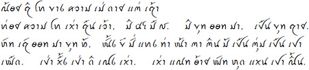

## Language Features

| | |
------------------- | -- |
**Local name** | ꪼꪕꪒꪾ, ꞌTáy, ꞌTáy Ðăm    
**Alternate names** | Black Tai, Hei Dai, Jinping Dai, Tai Do, Tai Noir, Tailam, Tailon, Thai Den, Thái Den, ꞌTáy, ꞌTáy Ðăm |
**Dialects** | |
**Status** | Living |
**OpenType tag** | [none] |
**Primary country of use** | Viet Nam |
**Other countries of use** | China, Laos, Thailand, United States |

## Scripts used to write this language

Script | Writing system code | Status | SLDR/CLDR locale | Regional variants |
-------- | ---------------------- | ------ | ------------------- | -------------------- |
[Tai Viet](/scrlang/script-tavt) | blt-Tavt | in use | [blt \[Tai Dam\]](https://unicode.org/cldr/charts/47/summary/blt.html) | blt-Tavt-VN (Viet Nam) |
[Latin](/scrlang/script-latn) | blt-Latn | in use | | blt-Latn-VN (Viet Nam) |
Lao | blt-Laoo | in use | | blt-Laoo-LA (Laos) |

## Characters used by this language

* [Tai Dam written with Tai Viet script](/scrlang/lang-blt-chars#blt-Tavt)

* [Tai Dam written with Latin script](/scrlang/lang-blt-chars#blt-Latn)

## Articles about this language

* [Writing the Tai Dam language](/scrlang/articles/writing-tai-dam-language)

* [ScriptSource: Geographic Use of the Tai Viet Script](https://scriptsource.org/entry/hg7bh64873)

* [ScriptSource: Sociolinguistic background of the Tai Viet script](https://scriptsource.org/entry/67379a5c7f)

* [ScriptSource: Tai Viet Consonants](https://scriptsource.org/entry/lbwpkrqk7b)

* [ScriptSource: Tai Viet Vowels](https://scriptsource.org/entry/lbwpkrqk7b)

## Resources for this language

* [**Keyman keyboards for Tai Dam**](https://keyman.com/keyboards?q=Tai%20Dam)

* [**SEAsite Tam Dam fonts**](http://seasite.niu.edu/tai/TaiDam/): The Center for Southeast Asian Studies (SEAsite) at Northern Illinois University has released two legacy fonts for displaying text in the Thai Song (Tai Song Dam) and Tai Dón (White Tai) languages. These can be freely downloaded in TTF format. They also post, under the name SIL Tai Dam, the legacy Tai Heritage font, but we recommend using the Unicode encoded Tai Heritage Pro from SIL instead.

* [**Tai Heritage Pro**](http://software.sil.org/taiheritage/): Tai Heritage Pro is a Unicode encoded font, designed to reflect the traditional hand-written style of the Tai Viet script. This is a sample paragraph of the font in use.

* **Tai Dam-Engish English-Tai Dam Vocabulary Book**: Baccan Don, Baccam Hung, Baccam Faluang, Dorothy Fippinger, _Tai Dam-English English-Tai Dam Vocabulary Book_ (Decorah, IA: The Anundsen Publishing Company: 1989).

## Links

* [Ethnologue](http://www.ethnologue.com/language/blt)

* [ISO 639-3 page for Tai Dam](http://iso639-3.sil.org/code/blt)

* [Open Language Archives Community](http://www.language-archives.org/language/blt)

* [Glottolog entry for Tai Dam](http://www.glottolog.org/glottolog?iso=blt)

* [SIL Language and Culture Archives](http://www.sil.org/resources/search/language/blt)

* [Universal Declaration of Human Rights in Tai Dam](http://efele.net/udhr/d/udhr_blt.txt)
