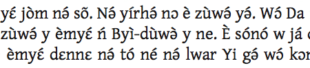

**Script Features** |     |     |     |
------------------- | --- | --- | --- |
**Script type** | alphabet            | **Diacritics** | yes |
**Family** | European                 | **Contextual forms** | no |
**Direction** | LTR                   | **Complex positioning** | yes |
**Baseline** | bottom                 | **Reordering** | no |
**Case** | yes                        | **Split graphs** | no |
**White space** | discretionary       | **Ligatures** | optional |
**ISO 15924 Code / Key** | Latn / 215 (left=to-right alphabetic) | **OpenType tag** | latn |
**Status** | currently in use| | |

## Script Description

The Latin script (also called the Roman script) is the most widely used writing system in the world, being the script of the English language, spoken by over 300,000,000 people worldwide. It is also the script used for writing a number of Romance, Germanic, Baltic and non-Indo-European languages, as well as the [International Phonetic Alphabet (IPA)](https://scriptsource.org/entry/ucgb77fkvh).

The script was derived from the Western variant of the Greek alphabet. The earliest extant inscription, an engraved brooch now in the ‘Museo Nazionale Preistorico Etnografico Luigi Pigorini’ in Rome, has been dated to the 7th century BC. The script developed slowly over the next thousand years, and by the 4th century AD many of the modern forms had been developed, and writing had settled into a consistent left to right direction. The Latin script was disseminated throughout western, northern and central Europe and the Baltic countries along with the Christian religion. However it was not until the colonization of the Americas, Australia, and parts of Asia, Africa and the Pacific that the script began to spread outside of Europe, carried by the English, Spanish, Portuguese, French, and Dutch languages.

As the script spread around the world, a number of language-specific amendments were made in order to accurately represent the sounds of various languages. These included ligatures, for example the German esszett ß, and a number of diacritics. Some languages also adapted the alphabet by the addition of entirely new letters, such as eth Ðð used in Faroese and Icelandic or epsilon Ɛɛ used in many Niger-Congo orthographies.

The Latin script is bicameral; it is written using both upper- and lower-case letters. It is written horizontally from left to right. Each letter sits on the baseline, with some letters having descenders hanging below the baseline, and some having ascenders protruding beyond the x-height. The script also uses a set of punctuation, which is almost entirely consistent across European languages. Exceptions to this include different styles of quotation marks (“ ” and « »), the Greek question mark, which is identical to the semicolon in many other languages (;), and the Spanish inverted question/exclamation marks (¿ and ¡).

Digits from 0-9 are used. These can be combined to represent larger numbers.

## Languages that use this script (6431)

Note that some of the languages listed are unwritten but would likely use Latin script if a writing system were developed.

Language | Writing system code | Status | SLDR/CLDR locale | Regional variants |
-------- | ---------------------- | ------ | ------------------- | -------------------- |
<u>Aari</u> | aiw-Latn | in use | | aiw-Latn-ET (Ethiopia) |
<u>Aasáx</u> | aas-Latn | unwritten | | aas-Latn-TZ (Tanzania) |
<u>Abadi</u> | kbt-Latn | in use | | kbt_Latn-PG (Papua New Guinea) |
<u>Abai Sungai</u> | abf-Latn | in use | | abf-Latn-MY (Malaysia) |
<u>Abanglekuo</u> | bzy-Latn | unwritten | | bzy-Latn-NG (Nigeria) |
<u>Abaza</u> | abq-Latn | in use | abq_Latn (SLDR) | abq-Latn-TR (Turkey) |
<u>Aceh</u> | ace-Latn | in use | | ace-Latn-ID (Indonesia)|
<u>Achang</u> | acn-Latn | in use | | ach-Latn-CN (China) ach-Latn-MM (Myanmar)|
<u>Adara</u> | kad-Latn | inuse | kad (SLDR) | kad-Latn-NG (Nigeria) |
<u>Adele</u> | ade-Latn | in use | ade (SLDR) | ade-Latn-TG (Togo) |
<u>Afar</u> \[aar\] | aa-latn | in use | [aa \[Afar\]](https://unicode.org/cldr/charts/47/summary/aa.html) | aa-Latn-DJ (Djibouti) aa-Latn-ER (Eritrea) aa-Latn-ET (Ethiopia)|
<u>Aguano</u> | aga-Latn | unwritten| | aga-Latn-PG (Papua New Guinea) |
_etc._ | | |

## Articles about this script

[ScriptSource: Where do upper- and lower-case come from? (Part 1 of 2)](https://scriptsource.org/entry/a5aqyqlztp)

[ScriptSource: Where do upper- and lower-case come from? (Part 2 of 2)](https://scriptsource.org/entry/d8mn7ztlj4)

## Resources for this script

**Alphabets of Africa**

Hartell, Rhonda L., ed., _Alphabets of Africa_ (Dakar, Sengal: UNESCO and Summer Institute of Linguistics: 1993)

This book seeks to make accessible to a wider public a sample of some 200 alphabets of the languages of Africa, especially those alphabets developed in the last 20 years. These alphabets should give a broad display of the linguistic richness of African languages.

Another purpose of this volume is to show what solutions have been adopted in various African countries for the difficult questions of special characters, writing tone, making word breaks, etc. We want to help developers of new alphabets make the wisest choices and to assist revisors make existing alphabets more practically useful. Hopefully it will also encourage the use of hitherto untapped resources.

[**Notes on Scripts, Orthographics and Characters, Lists of Terms**](https://r12a.github.io/scripts/#scriptnotes)

This page selects a few items that attempt to explain how scripts work in a way that is accessible to both the beginner and the script expert. The information includes tables of orthography descriptions, character notes and Unicode character apps.

Richard Ishida's site also has [filterable lists of terms](https://r12a.github.io/scripts/index.html#termbases) that can be used for finding examples or testing for letter combinations. Many terms are accompanied by meaning, IPA and other transcriptions, and for all it is possible to see the sequence of characters used.

[**Omniglot - Latin**](http://www.omniglot.com/writing/latin.htm)

Succinct article charting the progression of the Latin alphabet from the 7th century BC until modern times, with a number of links to other relevant pages.

[**On Diacritics**](http://ilovetypography.com/2009/01/24/on-diacritics/)

Article about the importance of Latin diacritics, and the challenges faced by type designers who want to include them in their fonts. The issues of weight and size, placement, stylistic harmony, and fitting / kerning are summarized, and particular mention is made of the caron.

