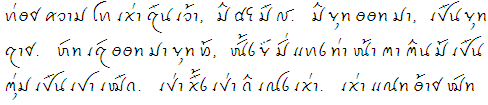

_"Mr. Countless Warts", recorded 1969-70 by B.Q., transcribed by Jay and Dorothy Fippinger_

**Script Features** |     |
------------------- | --- |
**Script type** | abugida |   
**Family** | Mainland Southeast Asian |
**Status** | currently in use |
**Direction** | LTR |
**Baseline** | bottom |
**Case** | no |        
**White space** | discretionary |
**Complex behaviors** | diacritics, contextualization, reordering, split graphs, ligatures |
**ISO 15924 Code / Key** | Tavt / 359 (alphasyllabic) |
**OpenType tag** | tavt |

## Script Description

The Tai Viet script is used for writing the Tai Dam, Tai Dón, Tai Daeng, Thai Song and Tày Tac languages spoken in Vietnam, Laos, China and Thailand. Speakers of these languages are also found in the United States, Australia and France. There is significant variation in the orthographic conventions of the Tai languages, as well as in their phonologies, which in turn impacts the orthography. However, a unified, standardized version of the script, with an agreed upon core set of characters, was developed at a UNESCO-sponsored workshop in 2006, and subsequently accepted for encoding in The Unicode Standard.

The script is an abugida. Consonants do not contain an inherent vowel; vowels must be written explicitly. Vowel marks may appear above, below, before or after a syllable's initial consonant. A written syllable therefore consists minimally of a consonant and a vowel. Optionally it may also contain a final consonant. There are two series of consonants, indicating high and low tone class. The Tai Viet script employs Latin punctuation as well as three non-alphabetic signs to indicate word repetition or a section break. It also uses two ligatures which may serve to disambiguate between homophonous words.

Traditionally, tone was only partially marked in the orthography. As in other Tai languages, tones were divided into two sets of three, and the appropriate selection of consonants from the high or low series indicated which set of tones the syllable belonged to. The reader had to determine the exact tone from context. However, around the 1970s, two different tone marking systems developed simultaneously in Vietnam and the United States; the concurrent use of both these systems is seen to be disadvantageous but, for the time being, unavoidable. There is no standard order for sorting characters. Some users have modified the order employed by the Lao script, others, the Vietnamese.
Little is known about the origin of the Tai Viet script. It appears to have been derived from the Thai script around the 16th century, which is in turn of Khmer, and ultimately Brahmic, origin.

Please note that, although the Tai Viet script does exhibit reordering behaviour, that reordering is not typically reflected in software implementations. See Syllable Structure and Reordering in Tai Viet or Reordering and Data Storage Order for more details.

## Languages that use this script (5)

Language | Writing system code | Status | SLDR/CLDR locale | Regional variants |
-------- | ---------------------- | ------ | ------------------- | -------------------- |
<u>Tai Daeng</u> | tyr-Tavt | in use | | tyr-Tavt-VN (Viet Nam) |
[Tai Dam](https://writingsystems.info/scrlang/lang-blt) | blt-Tavt | in use | [blt \[Tai Dam\]](https://unicode.org/cldr/charts/47/summary/blt.html) | blt-Tavt-VN (Viet Nam) |
<u>Tai Dón</u> | twh-Tavt | in use | | twh-Tavt-VN (Viet Nam) |
<u>Tày Tac</u> | tyt-Tavt | in use | | tyt-Tavt-VN (Viet Nam) |
<u>Thai Song</u> | soa-Tavt | in use | | soa-Tavt-VN (Viet Nam) |

## Unicode information

Character Block | Character Range | Added in Unicode Version | Unicode Chart |
--------------- | --------------- | ------------------------ | ------------- |
Tai Viet | AA80..AADF | 5.2 | [UAA80.pdf](http://www.unicode.org/charts/PDF/UAA80.pdf) |

[Full Unicode status](https://writingsystems.info/scrlang/articles/tavt-unicode-status)

## Articles about this script

[Writing Tai Don in the Tai Viet Script](https://writingsystems.info/scrlang/articles/writing-tai-don-in-tai-viet-script)

[ScriptSource: Tai Viet Consonants](https://scriptsource.org/cms/scripts/page.php?item_id=entry_detail&uid=lbwpkrqk7b)

[ScriptSource: Tai Viet Consonants: Final Forms](https://scriptsource.org/cms/scripts/page.php?item_id=entry_detail&uid=wf6hxndwyv)

[ScriptSource: Punctuation in Tai Viet](https://scriptsource.org/cms/scripts/page.php?item_id=entry_detail&uid=cgb457356b)

[ScriptSource: Non-alphabetic symbols in the Tai Viet script](https://scriptsource.org/cms/scripts/page.php?item_id=entry_detail&uid=c8hc999bc3)

[ScriptSource: Reordering and data storage](https://scriptsource.org/cms/scripts/page.php?item_id=entry_detail&uid=l5bvp27v3r)

[ScriptSource: Sociolinguistic background of the Tai Viet script](https://scriptsource.org/cms/scripts/page.php?item_id=entry_detail&uid=67379a5c7f)

[ScriptSource: Sort order of Tai Viet characters](https://scriptsource.org/cms/scripts/page.php?item_id=entry_detail&uid=526eb6gcce)

[ScriptSource: Tone Marking in Tai Viet](https://scriptsource.org/cms/scripts/page.php?item_id=entry_detail&uid=gd75e3bb44)

## Resources for this script

[Google Noto Fonts](https://www.google.com/get/noto/)

Google has been developing a font family called Noto, which aims to support all languages with a harmonious look and feel. Noto is Google’s answer to tofu. The name Noto is to convey the idea that Google’s goal is to see “no more tofu” (tofu being the nickname for the small square boxes displayed when characters are missing from a font). Noto has multiple styles and weights, and is freely available to all.

[SEAsite Tai Dam Font](http://www.seasite.niu.edu/tai/TaiDam/)

The Center for Southeast Asian Studies (SEAsite) at Northern Illinois University has released two legacy fonts for displaying text in the Thai Song (Tai Song Dam) and Tai Dón (White Tai) languages. These can be freely downloaded in TTF format. They also post, under the name SIL Tai Dam, the legacy Tai Heritage font, but we recommend using the Unicode encoded  Tai Heritage Pro from SIL instead.

[SIL Tai Dam (custom-encoded) Fonts](http://scripts.sil.org/SILTD_home)

The SIL Tai Dam fonts are regular and bold versions of the traditional Tai Dam script (now referred to as Tai Viet) and are closely based on handwritten letters. The fonts are available for both Macintosh and Windows systems and include keyboard definitions.
Please note, these fonts are not Unicode encoded.  Tai Heritage Pro is a Unicode-encoded typeface based on the SIL Tai Dam fonts.

[Tai Heritage Pro Font](http://software.sil.org/taiheritage/)

Tai Heritage Pro is a Unicode encoded font, designed to reflect the traditional hand-written style of the Tai Viet script. This is a sample paragraph showing the font in use.

**Tai Dam-Engish English-Tai Dam Vocabulary Book**

Baccan Don, Baccam Hung, Baccam Faluang, Dorothy Fippinger, _Tai Dam-English English-Tai Dam Vocabulary Book_ (Decorah, IA: The Anundsen Publishing Company: 1989).

## General resources

**[Script comparison table](https://r12a.github.io/scripts/script-features/)**

**[Unicode character pickers](https://r12a.github.io/pickers/)**

**[Creating and supporting OpenType fonts for the Universal Shaping Engine](http://www.microsoft.com/typography/OpenTypeDev/USE/intro.htm)**

**[Notes on Scripts, Orthographies and Characters, Lists of Terms](https://r12a.github.io/scripts/#scriptnotes)**