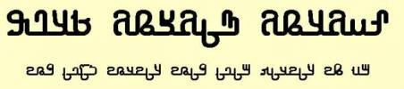

import ScriptDetails from '../../../../components/ScriptDetails.astro';
import ScriptResources from '../../../../components/ScriptResources.astro';
import WsList from '../../../../components/WsList.astro';
import TaggedSources from '../../../../components/TaggedSources.astro';

## Script details

<ScriptDetails />

## Script description

The Adlam script is used for writing the Fulani language in Guinea.

Read the full description...
Prior to the creation of this script, the Fulani language was written in the Latin and Arabic scripts. In the 1980s, two teenage brothers, Ibrahima and Abdoulaye Barry, wondered why their language did not have its own script and set about creating one. They named their script ‘Adlam’ because the first four characters in the repertoire represent A, D, L, and M.

Following the creation of the script, the two brothers initially produced hand-written textbooks to aid in its dissemination. They first taught their other family members to read and write, then the women and children in their village. Along with the script, the books taught lessons in water hygiene and basic medical care. Gradually, the script grew in popularity and the brothers set up learning centres in Togo, Senegal, Benin, and even amongst Fulani speakers in New York. Eventually, the means were available to print the script, and a newspaper and a number of printed books were published. However, the rapid growth of Adlam attracted the attention of the Guinean government, who were opposed to the new script which they could not read, and Ibrahim was imprisoned for three months. After his release, in 2007, he moved to America and took a job with a software company. He used the expertise and financial savings he acquired there to create software for Adlam, and by 2012 three fonts and a keyboard had been created.

The script is written from right to left and letters can be joined to one another (cursive) or separate. There are 28 letters in all, and each letter has four forms, including upper- and lower-case forms. The script is an alphabet, with both consonant and vowel characters. Adlam also contains a set of digits from 0-9 and a number of diacritics for marking vowel length, [gemination](/reference/glossary#gemination), and foreign sounds. The glottal stop is also indicated with a diacritic.

## Languages that use this script

<WsList script='Adlm' wsMax='5' />

## Unicode status

In The Unicode Standard, Adlam Script implementation is discussed in [Chapter 19 Africa](https://www.unicode.org/versions/latest/core-spec/chapter-19/#G56860) and in [Evolution of Adlam Characters Since Encoding](https://www.unicode.org/notes/tn58/).

- [Full Unicode status for Adlam](/scrlang/unicode/adlm-unicode)

## Resources

<TaggedSources tag='script-adlm' />

