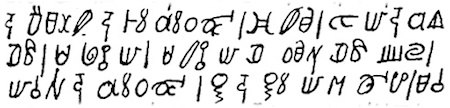

import ScriptDetails from '../../../../components/ScriptDetails.astro';
import ScriptResources from '../../../../components/ScriptResources.astro';
import WsList from '../../../../components/WsList.astro';

## Script details

<ScriptDetails />

## Script description

The Afaka script was a syllabary created around 1910 for writing the Nenge (also called Ndjuka, or Eastern Maroon Creole) language, an English [creole](/reference/glossary#creole) spoken by about 23,000 people in Suriname and French Guyana.

Read the full description...
It is the only known indigenous script for a creole language. The script was named for its inventor, a Nenge man called Afaka Atumisi. It is now believed to have fallen into disuse.

Syllable structure in the Nenge language allows for initial consonant clusters containing a nasal and a stop, and for doubly articulated consonants (two consonants produced simultaneously at different places in the oral cavity). Vowels can also be complex or nasalized. If each of these is considered to be a single sound, as is the case for speakers of the language, syllables can be analyzed as exclusively consisting of a consonant + vowel. In the Afaka script, single letters were used to represent these complex consonant + vowel combinations. However, this resulted in many contrasts in the language being unrepresented in writing. The same letters were used to write [bo] 'bow' and [bṍ] 'bone', for example. Syllables starting with the sounds [b], [d], [dj],[f], [g], [l], [m], [n], [s], and [j] were written with the same letter regardless of the following vowel. The vowels [i] and [e] were not represented when following the consonants [l], [m], [s], and [w]. Tone is also contrastive in the language, but was not written. [na] 'is' and [ná] 'is not' vary only in tone, so were written the same. Given the predictable subject matter for which the script was generally used - most texts repeated many fixed religious expressions - this underrepresentation did not necessarily hamper understanding when reading. However, it became more problematic when users needed to express novel or less predictable expressions, which the deficiencies in the script left ambiguous.

One punctuation mark was used, a vertical line which marks the end of a clause or a sentence, roughly equivalent to a comma and a full stop. Inter-word spacing was used, but not by everyone.

Afaka's script came to the attention of the wider world in 1915, when Brother Bernard, a Catholic missionary in Suriname, observed a man reading a book full of unknown symbols. The man was Afaka's brother-in-law Abena, one of about 30 people to whom Afaka had taught the script. Abena asked Br. Bernard to dictate a number of liturgical Catholic prayers in Nenge, which he then recorded in the script. Much of what is known about the script is attributed to Br. Bernard's colleague, Father Morssink, who went to considerable lengths to study and propagate the script, with limited success.

The limited success of the script is believed to have been largely due to its underrepresentation of many phonological contrasts. It was likely due in part to its associations with European missionaries; some Nenge speakers saw it as a means to convert them to a European faith. In addition, literacy had never been a part of the Nenge society, and many saw no reason to change their traditional way of life, especially at a perceived cost to their spiritual welfare. A more controversial view is that the symbols already existed prior to the creation of the script, but that they had religious, rather than phonetic, significance. Many of them resemble acrophonic rebuses - stylized pictures of something which begins with the sound the symbol stands for - from Africa, where they may have been used in religious ceremonies. Some Nenge may have felt that using the sacred symbols for mundane or secular purposes would be irreverent.

## Languages that use this script

<WsList script='Afak' wsMax='5' />

## Unicode status

The Afaka script is not yet in Unicode. The script has a tentative allocation at U+16D00..U+16D3F in the [Roadmap to the SMP](http://www.unicode.org/roadmaps/smp/) for the Unicode Standard.

- [Full Unicode status for Afaka](/scrlang/unicode/afak-unicode)

## Resources

<ScriptResources detailSummary='seemore' />

