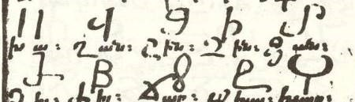

import ScriptDetails from '../../../../components/ScriptDetails.astro';
import WsList from '../../../../components/WsList.astro';
import ArticlesList from '../../../../components/ArticlesList.astro';
import SourceLinksList from '../../../../components/SourceLinksList.astro';
import BibList from '../../../../components/BibList.astro';
import Attribution from '/src/components/Attribution.astro';
import CaptionText from '/src/components/CaptionText.astro';

<CaptionText text="The Matenadaran MS 7117 is a manuscript which contains apologetic texts as well as codex of different alphabets such as Armenian, Greek, Latin, Syriac, Georgian, Coptic and Caucasian Albanian alphabet manual of the 15th century."/>
<Attribution
    type="Image"
    copyholder=""
    copyurl=""
    copyyears=""
    license="Public Domain"
    licenseurl=""
    author=""
    source="Wikimedia"
    sourceurl="https://commons.wikimedia.org/wiki/File:Alban-script.jpg"
/>

## Script details

<ScriptDetails />

## Script description

The Caucasian Albanian script was used  to write the language of Caucasian Albania (which is not the same as present-day European Albania).

Read the full description...
The Caucasian Albanian language was a dialect of Old Udi, which is closely related to the Eastern Samur branch of Lezgian.

The Caucasian Albanian script was an alphabet written from left to right with spaces between words. There were fifty-two letters in the alphabet. It is thought to have been based on Greek writing.

## Languages that use this script

<WsList script='Aghb' wsMax='5' />

## Unicode status

In The Unicode Standard, Caucasian Albanian implementation is discussed in [Chapter 8 Europe-II — Ancient and Other Scripts](https://www.unicode.org/versions/latest/core-spec/chapter-8/#G32223).

- [Full Unicode status for Caucasian Albanian](/scrlang/unicode/aghb-unicode)

Other:

- [Unicode status for Combining marks](/scrlang/unicode/x-comb-marks-unicode)

## Resources

<ArticlesList tag='script-aghb' header='Related articles' />

<SourceLinksList tag='script-aghb' header='External links' entrytype='online' />

<BibList tag='script-aghb' header='Bibliography' entrytype='non-online' />

