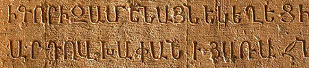
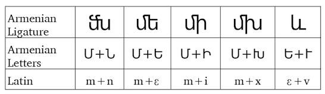
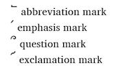

import ScriptDetails from '../../../../components/ScriptDetails.astro';
import WsList from '../../../../components/WsList.astro';
import ArticlesList from '../../../../components/ArticlesList.astro';
import SourcesList from '../../../../components/SourcesList.astro';
import Bibliography from '../../../../components/Bibliography.astro';

## Script details

<ScriptDetails />

## Script description

The Armenian alphabet was created around 405AD by Mesrop Mashtots.He reportedly studied a number of scripts, including Greek and Syriac, before having a dream in which he saw elements of these scripts integrated into one system. The Ge'ez script has also been suggested as a possible influence. Armenia adopted Christianity in the early fourth century, but later began reverting to paganism. Mashtots believed that if the Bible could be written in Armenian the country would have the means to maintain a Christian faith and culture at a time when the Persian empire was attempting to assimilate the country. It also enabled Armenian educational institutions to be established, as well as a large body of early Armenian literature. The alphabet has been used in the country since its inception, with some modifications.

There were originally 30 consonant and 6 vowel letters in the alphabet, but in the 12th century two more letters were added for representing [aw] and [f], bringing the total to 38. A third symbol was also introduced to represent the word 'and' in lower case form. Much later, in the early 20th century, orthographic reform under the Soviet government led to two spelling conventions being used. Broadly speaking, Mesropian orthography is used throughout the Armenian diaspora (which makes up the majority of Armenian speakers),  and Reformed orthography is used within Armenia. The difference between the two has been likened to that between British and American English, though with stronger political connotations.

Early Armenian writers relied heavily on ligated form of letters in order to save space. Five of these are still in common use, to combine the symbol for [m] with [n], [ɛ], [i] and [x], and to combine the symbol for [ɛ] with [v]. 

A ligature also used to exist which combined the symbols representing [ɛ] + [w]/[v], but it is used so commonly that followers of the Reformed orthography consider it a distinct letter rather than a ligature, bringing their total number of symbols to 39.

The script is an alphabet; consonants and vowels are written with independent letters. It is read from left to right. The traditional order of the letters composes an acrostic prayer. It is generally believed that this order follows the order of the Greek alphabet, although it has also been suggested that Mashtot followed a number symbolism found in early kabbalistic traditions when ordering the letters. 

Armenian is written with spaces between words. There are four punctuation marks unique to Armenian, two of which follow a word to indicate that it has been abbreviated, or to add emphasis, and two marks which are placed after and above the last vowel, respectively, as a question mark and an exclamation mark. Non-Latin marks are used to perform the functions of full stop, semicolon, word-joining and word-splitting hyphen. The script employs upper and lower case.

Written Armenian contains no script-specific numbers, rather, each letter was assigned a numeric value. In recent years and particularly in print form, Latin numbers have increasingly been used.

## Languages that use this script

<WsList script='Armn' wsMax='5' />

## Unicode status

In The Unicode Standard, Armenian script implementation  is discussed in [Chapter 7 Europe-I — Modern and Liturgical Scripts](https://www.unicode.org/versions/latest/core-spec/chapter-7/#G3334).

- [Full Unicode status for Armenian](/scrlang/unicode/armn-unicode)

## Resources

<ArticlesList tag='script-armn' header='Related articles' />

<SourcesList tag='script-armn' header='External links' />

<Bibliography tag='script-armn' header='Bibliography' />

