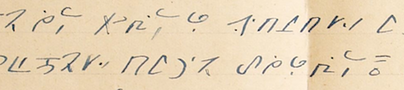

import ScriptDetails from '../../../../components/ScriptDetails.astro';
import ScriptResources from '../../../../components/ScriptResources.astro';
import WsList from '../../../../components/WsList.astro';

## Script details

<ScriptDetails />

## Script description

The Bamum script of Cameroon, sometimes referred to as Shumom, was devised at the end of the C19th following a dream in which the Bamum King Njoya was inspired to provide a writing system for his people by creating a series of pictographs.

Read the full description...
The script was something of a communal production; the Bamum people were reportedly invited to supply the King with a number of simple symbols, from which he chose more than 500 to use in the Bamum script. Initially, the script was logographic, but it underwent a series of changes influenced by the rebus principle. After about 30 years, full phonetic representation had been realized, and the script had developed into a syllabary composed of just 80 base characters.

Both spoken and written Bamum are based around the (C)V syllable although syllable-final consonants, limited to [p], [t], [m], [n], [ŋ], can also occur. The script is written from left to right, allegedly to remove any Arabic associations. It also employs 5 punctuation marks, roughly corresponding to the Latin full stop, comma, colon, semi-colon and question mark, as well as a differentiating mark, _nʒɛmli_, which differentiates two homonyms. _Nʒɛmli_ is also placed in front of proper nouns by way of identification.

Two diacritics, _koʔndon_ and _tukwentis_, are also used. _Koʔndon_ can be added to any of the 80 base characters. Most commonly, it serves to reduce the number of heteronyms in the language by adding a glottal stop - which is distinctive in spoken Bamum - to the syllable. Sometimes it can be used to change the initial consonant of the syllable, or, less commonly, to indicate a semantic rather than phonetic difference. _Tukwentis_ can be added to 13 of the base characters, in most cases to mute the inherent vowel in a syllable. It is also written above the vowel [o] to change it to [ə].

The Bamum script was used for administrative purposes, documentation and education, until the 1930s saw King Njoya exiled by German and French colonial powers who also closed the schools and attempted to destroy documents written in the script. It has now fallen into disuse, but the [Bamum Scripts and Archives Project](http://www.bamumscript.org) exists to preserve and digitally archive manuscripts written in the script and prevent its total loss.

## Languages that use this script

:::note
A status of _obsolete_ indicates that the writing system is no longer in use for that language; the language may still be spoken.
:::

<WsList script='Bamu' wsMax='5' />

## Unicode status

In The Unicode Standard, Bamum script implementation is discussed in [Chapter 19:Africa](https://www.unicode.org/versions/latest/core-spec/chapter-19/#G45398).

- [Full Unicode status for Bamum](/scrlang/unicode/bamu-unicode)

## Resources

<ScriptResources detailSummary='seemore' />

