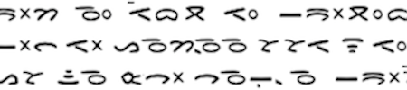

import ScriptDetails from '../../../../components/ScriptDetails.astro';
import ScriptResources from '../../../../components/ScriptResources.astro';
import WsList from '../../../../components/WsList.astro';

## Script details

<ScriptDetails />

## Script description

The Batak script is used to write the six Batak languages (Toba, Karo, Dairi, Mandailing, Simalungun and Angkola) spoken collectively by approximately 3 million people on the Indonesian island of Sumatra.

Read the full description...
It is one of several scripts indigenous to the Indonesian archipelago, descended from the Old Kawi script, which in turn is derived from the Pallava, and ultimately the Brahmi, script.

It is an abugida; its 18 consonant letters each contain an inherent [a] vowel, which is modified by means of diacritics for other vowels. Syllable-final consonants are indicated by means of a pangolat (virama). Consonants do not form conjuncts. Punctuation is not normally used, but a number of bindu characters are used to disambiguate similar words or phrases or to separate sections of text. These marks may each have a number of variants and may perform more of an ornamental than a grammatical function. A further sign (pustaha) exists to separate a title from the following body of text, which normally begins on the same line.

Batak is read from left-to-right. Some have observed it being written vertically bottom-to-top along the length of a piece of bamboo. These bamboo stalks were placed next to each other and bound together with string in such a way as to form a bundle of plates inscribed with horizontal lines of right-running text.

The script was standardised in the 1850s, and was used in education until the declaration of Bahasa Indonesia as the national language in 1945, since which time literacy and usage has declined. However, something of a Batak renaissance in recent years has led to teaching materials once again being made available for use in schools.

## Languages that use this script

:::note
A status of _obsolete_ indicates that the writing system is no longer in use for that language; the language may still be spoken.
:::

<WsList script='Batk' wsMax='5' />

## Unicode status

In The Unicode Standard, Batak script implementation is discussed in [Chapter 17 Indonesia and Oceania](http://www.unicode.org/versions/latest/ch17.pdf).

- [Full Unicode status for Batak](/scrlang/unicode/batk-unicode)

## Resources

<ScriptResources detailSummary='seemore' />

