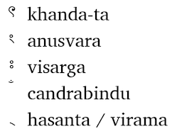

import ScriptDetails from '../../../../components/ScriptDetails.astro';
import ScriptResources from '../../../../components/ScriptResources.astro';
import WsList from '../../../../components/WsList.astro';

## Script details

<ScriptDetails />

## Script description

The Bengali (also called Bangla) script is used for writing the Bengali language, spoken by over 180,000,000 people mostly in Bangladesh and India.It is also used for a number of other Indian languages including Sylheti and, with one or two modifications, Assamese. It is a Brahmic script although its exact derivation is disputed. Bengali writing shares some similarities with the Dravidian-language scripts, particularly in the shapes of some vowel letters, but it is generally more similar to the Aryan-language scripts, in particular Devanagari.

Bengali is an abugida - that is, every consonant letter represents a syllable containing an inherent vowel - written from left to right. There is no upper- or lower-case. There are thirty-five consonant letters and eleven independent vowel letters, two of which represent the diphthongs [oj] and [ow]. Each vowel letter also has a diacritic form which combines with a consonant to modify the inherent vowel. These can be written to the left or the right of, or above or below the consonant. Some are [digraphs](/reference/glossary#multig), written with part of the letter before and part after the consonant. Some vowel diacritics take contextual forms, for example _u_ changes shape following _g_ or _ʃ_. Some consonant-vowel combinations have a traditional ligated form which is often visually dissimilar to the base consonant+vowel diacritic form. These are more commonly found in handwriting, but occasionally in printed text also.

There are three modifier signs, _khanda-ta_ (represents a final dental stop), _anusvara_ (nasalizes a final velar), _visarga_ (represents a voiceless breath after a vowel), and _chandra bindu_ (nasalizes a vowel). There is also a symbol, _hasanta_, to mute the inherent vowel.

Bengali writing differs from most Indian abugidas in that the inherent vowel in a syllable is either [ɔ] or [o]. In general, it is pronounced [ɔ] except when followed by [i], [j], [u] or [w], in which contexts it is pronounted [o]. However this is not always predictable. In addition, at the end of a syllable (at the end of or within a word), the vowel is often not pronounced even when this is not indicated with _hasanta_. So the letters _m_+_t_ can represent either [mɔt] 'opinion' or [moto] 'approximately', but _g_+_t_ always represents [gɔto] 'past'.

Consonants regularly form conjuncts, normally of two letters, more rarely of three or four. Often these involve little or no change in letterform, but in some cases one letter changes unrecognizably from its isolated form and in a few cases both letters do so. Conjuncts are written with the parts alongside each other or in stacks. Pronunciation of conjuncts is not always what would be expected from the sum of their parts, due to sound changes in spoken Bengali which are not represented in writing. The _j_+_ñ_ conjunct is pronounced [g]+nasalization at the start of a word or [gg] elsewhere, for example _bijña_, pronounced [biggo/õ] 'wise'. Combinations of C+_m_ are pronounced at the start of a word as C+nasalization, or as CC elsewhere. The conjunct _kʃa_ represents [khɔ] at the start of a word and [khhɔ] within a word, as in the case of the woman's name written _lakʃmi_ but pronounced [lokkhi].

Some other spelling conventions also reflect archaic pronunciation. The three sibilant letters which represented three separate sounds [ʂ], [ʃ] and [s] in Brahmi writing have been retained in Bengali orthography, all representing [ʃ] except before [t], [n], [r] or [l], when they all assimilate to [s]. 

Bengali employs a set of script-specific digits 0-9.

The Devanagari full stop, a vertical line, is used in Bengali alongside Latin punctuation.

## Languages that use this script

:::note
A status of _obsolete_ indicates that the writing system is no longer in use for that language; the language may still be spoken.
:::

<WsList script='Beng' wsMax='5' />

## Unicode status

In The Unicode Standard, Bengali script implementation is discussed in [Chapter 12 South and Central Asia-I — Official Scripts of India](https://www.unicode.org/versions/latest/core-spec/chapter-12/#G664195).

- [Full Unicode status for Bengali](/scrlang/unicode/beng-unicode)

Other:

- [Unicode status for Vedic](/scrlang/unicode/x-vedic-unicode)
- [Unicode status for Currency](/scrlang/unicode/x-currency-unicode)

## Resources

<ScriptResources detailSummary='seemore' />

