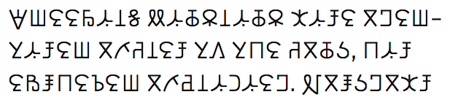

import ScriptDetails from '../../../../components/ScriptDetails.astro';
import ScriptResources from '../../../../components/ScriptResources.astro';
import WsList from '../../../../components/WsList.astro';

## Script details

<ScriptDetails />

## Script description

The Beria Erfe script, also known as Erfa, or Erfe, is used to write the Zaghawa language spoken by about 169,000 people in Chad and Sudan.

Read the full description...
It was created in the 1950s when Adam Tajir, a schoolteacher, noted that the language was failing to spread and was in fact being replaced by Arabic, which he attributed to the lack of a Zaghawa writing system. The script was originally based on the cattle brands different clans used by way of identification. This alphabet comprised 40 characters, representing more sounds than exist in the Zaghawa inventory, as Tajir had based the character set on the Arabic language, rather than the language for which it was intended. Tajir published his proposed characters in a daily Arabic-language newspaper, and also produced texts of poetry, proverbs and short stories using the script in an attempt to propagate it. In 2000 Tajir's script was modified by Siddick Adam Issa to better represent Zaghawa phonology. Issa's modified version has received greater acceptance, and is in more common use today.

The Beria Erfe script marks stress and not tone, although transcriptions tend to mark tone but not stress. ±ATR, representing contrasting positions of the root of the tongue and of the larynx during pronunciation of vowels, is also marked.

## Languages that use this script

<WsList script='Berf' wsMax='5' />

## Unicode status

The Beria Erfe script is not yet in Unicode. The script has a provisional assignment at U+16EA0..U+16EDF in the [Roadmap to the SMP](http://www.unicode.org/roadmaps/smp/) for the Unicode Standard.

- [Full Unicode status for Beria Erfe](/scrlang/unicode/berf-unicode)

## Resources

<ScriptResources detailSummary='seemore' />

