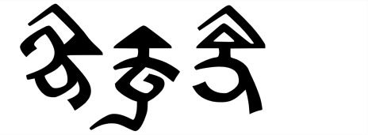

import ScriptDetails from '../../../../components/ScriptDetails.astro';
import ScriptResources from '../../../../components/ScriptResources.astro';
import WsList from '../../../../components/WsList.astro';

## Script details

<ScriptDetails />

## Script description

Bhaiksuki is an extinct script used for writing Buddhist texts in the Indian state of Bihar.

Read the full description...
It is also known as the Arrow-Headed script due to the shape of the letters, many of which are capped with one or more triangular “arrows”. Little is known about this script, but the [Arrow-Headed Script Project](https://www.uni-marburg.de/de/fb10/iksl/faecher/indologie/forschung/drittmittelprojekte/arrow-headed-script) at Philipps-Universität Marburg, Germany is working to change that.

## Languages that use this script

<WsList script='Bhks' wsMax='5' />

## Unicode status

In The Unicode Standard, Bhaiksuki script implementation is discussed in [Chapter 14: South and Central Asia-III — Ancient Scripts](https://www.unicode.org/versions/latest/core-spec/chapter-14/#G40424).

- [Full Unicode status for Bhaiksuki](/scrlang/unicode/bhks-unicode)

## Resources

<ScriptResources detailSummary='seemore' />

