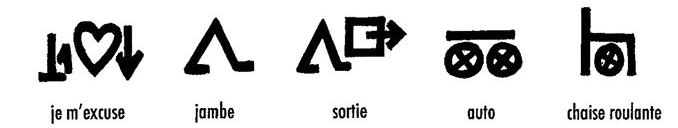

import ScriptDetails from '../../../../components/ScriptDetails.astro';
import ScriptResources from '../../../../components/ScriptResources.astro';
import WsList from '../../../../components/WsList.astro';

## Script details

<ScriptDetails />

## Script description

Blissymbols was developed after the Second World War by Charles Bliss, to facilitate communication between speakers of different languages.

Read the full description...
It has also been used to help people with severe speech impediments to communicate without the need to speak, although Bliss did not approve of this usage. It is used in particular by people who struggle both to speak and to read or spell. The system consists of 4,000 symbols representing various abstract and concrete concepts. The symbols are not related in any way to the pronunciation of a word, so can be used in conjunction with any spoken language.

The symbols are derived from standard geometric shapes and are either pictographs, such as a jagged line to represent the concept _electricity_, or ideographs, such as a triangle to represent the concept _creation_.

Symbols can be combined to represent additional concepts, for example, the symbols for _house_ and _money_ can be combined to represent _bank_. In these cases, there is a correct, standardized order in which to write the combinations of symbols.

Symbols can also be superimposed on top of one another, for example, the symbol for _mouth_ can be superimposed onto _nose_ to represent _taste_. Some symbols have an arbitrary shape, such as the articles _a/an_ and _this_.

The meaning of a symbol is determined not only by its shape but by its size. For example, a full-size circle represents the concept _sun_, and a half-size circle represents _mouth_. Sometimes visually similar symbols are also semantically related, for example a full-size upside-down ‘v’ represents _action_, but the same symbol half the size represents _activity_.

The position and orientation of a symbol can also affect its meaning. A horizontal dash at the [baseline](/reference/glossary#baseline) represents _ground_, but slightly higher it represents _sky_. A single symbol is also used to represent both _steam_ (pointing upwards) and _rain_ (pointing downwards).

Punctuation marks, similar to those used in the Latin script but sometimes differing in proportion, are also used. A space half the width of a symbol is left between a word and any following punctuation mark. A space the width of a symbol is left between two words.

Blissymbols does not benefit from the use of a wide variety of fonts, as consistency is important in order for the symbols to be understood.

## Languages that use this script

:::note
A status of _obsolete_ indicates that the writing system is no longer in use for that language; the language may still be spoken.
:::

<WsList script='Blis' wsMax='5' />

## Unicode status

Blissymbols are not yet in Unicode. The script has a tentative allocation at U+16200..U+1677F in the [Roadmap to the SMP](http://www.unicode.org/roadmaps/smp/) for the Unicode Standard.

- [Full Unicode status for Blissymbols](/scrlang/unicode/blis-unicode)

## Resources

<ScriptResources detailSummary='seemore' />

