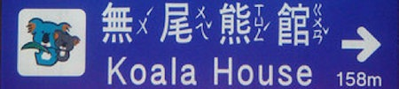

import ScriptDetails from '../../../../components/ScriptDetails.astro';
import ScriptResources from '../../../../components/ScriptResources.astro';
import WsList from '../../../../components/WsList.astro';

## Script details

<ScriptDetails />

## Script description

Bopomofo is the colloquial name given to the Zhuyin Fuhao phonetic system for transcribing Chinese.

Read the full description...
The script is used particularly often by students of the Mandarin language. It was developed in 1913 by the Commission on the Unification of Pronunciation (讀音統一會) in China to extend the use of Mandarin. It is still used by many books, newspapers and journals in Taiwan, to annotate the Taiwanese pronunciation of Chinese Han characters or spell out Taiwanese words for which no character exists, but has been largely replaced by Pinyin romanization in mainland China. The script is also used as the primary script for writing some of Taiwan's minority languages including Atayal, Taroko, Paiwan and Yami.

The script is a semi-syllabary based on syllable rhymes (normally the simple or complex vowel and optional closing consonant in a syllable) and onsets (the initial consonant preceding the rhyme). Of the 37 signs employed in Bopomofo writing, 21 represent onset consonants and 16 represent rhymes. Tones are written using diacritics.

The shapes of the symbols are taken from parts of Chinese characters containing the relevant sound. The stroke order with which the signs are written is also based on that of Chinese characters.

## Languages that use this script

:::note
A status of _obsolete_ indicates that the writing system is no longer in use for that language; the language may still be spoken.
:::

<WsList script='Bopo' wsMax='5' />

## Unicode status

In The Unicode Standard, Bopomofo implementation is discussed in [Chapter 18: East Asia](https://www.unicode.org/versions/latest/core-spec/chapter-18/#G22467).

- [Full Unicode status for Bopomofo](/scrlang/unicode/bopo-unicode)

## Resources

<ScriptResources detailSummary='seemore' />

