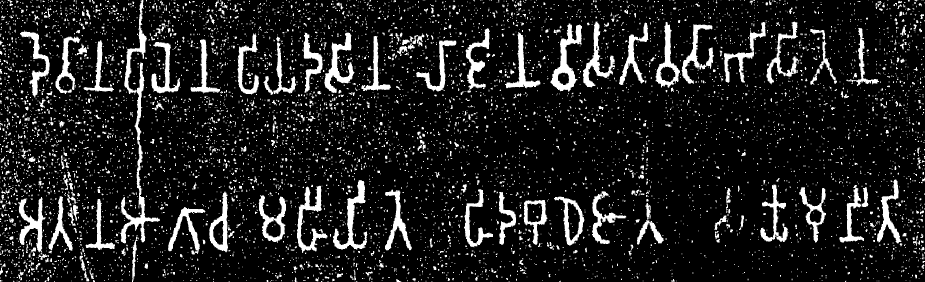

import ScriptDetails from '../../../../components/ScriptDetails.astro';
import ScriptResources from '../../../../components/ScriptResources.astro';
import WsList from '../../../../components/WsList.astro';

## Script details

<ScriptDetails />

## Script description

The Brahmi script is ancestral to most of the scripts of South Asia, Southeast Asia, and to some Central Asian scripts.

Read the full description...
The name Brahmi actually does not refer to a single, discrete script as such; general practise is to use the term to refer to any script in the family now known as Brahmic, up until approximately 400 AD, at which point they became differentiated enough to be given their own names. Brahmic writing was originally used for writing early dialects of the Prakrit language, but spread widely during the period of Indian cultural expansion in the 1st millennium AD and has since provided the underlying design for over sixty scripts used by languages from the Indo-Aryan, Dravidian, Austro-Asiatic and Tibeto-Burman language families. By about 1000 AD the various varieties of Brahmic writing had diverged to the point that they were all independent scripts whose common ancestry was not always immediately apparent.

The earliest writing system in India was the Indus (Proto-Indic) script used by the Harrappan civilization of the Indus valley around 2500-1500BC. After this system fell from use, there appears to have been a long hiatus from which period we do not have any evidence of writing, until approximately 500 BC, at which time two writing systems appeared. One of these was Kharoshthi; the other was Brahmi. The origins of Brahmi are not known for certain, but it is thought to have been influenced by the Imperial Aramaic script.

Brahmi writing has been attested primarily in inscriptions on graves and buildings, most famously the edicts made by Emperor Ashoka around 200 BC. It was not until 1836 that these were decoded, by James Prinsep, which enabled the deciphering of other inscriptions.

The Brahmi script was generally written from left to right, with some rare exceptions. The script was an abugida; there were thirty-three consonant letters each representing a CV syllable containing the inherent vowel 'a'. Other post-consonantal vowels were written using one of nine vowel diacritics (together with the inherent vowel, five pairs of long and short vowels could be represented) around the consonant letter. There were also nine letters for writing vowels which were not preceded by a consonant. Special conjunct letters existed for writing consonant clusters. Many of these features have been retained by descendant scripts from Brahmi. It is notable that the head-mark, which is characteristic in many varieties of a number of scripts derived from Brahmi, is missing from Brahmi writing itself. It is thought that this head-mark arose incidentally as a result of writing with a reed pen, and later became an integral part of the script.

There is some indication that the Eastern Magar [mgp] language is currently using a script called Magar Akkha. However, it appears to be an appropriation of Brahmi.

## Languages that use this script

<WsList script='Brah' wsMax='5' />

## Unicode status

In The Unicode Standard, Brahmi script implementation is discussed in [Chapter 14: South and Central Asia-III — Ancient Scripts](https://www.unicode.org/versions/latest/core-spec/chapter-14/#G39063).

- [Full Unicode status for Brahmi](/scrlang/unicode/brah-unicode)

## Resources

<ScriptResources detailSummary='seemore' />

