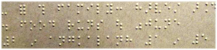

import ScriptDetails from '../../../../components/ScriptDetails.astro';
import ScriptResources from '../../../../components/ScriptResources.astro';
import WsList from '../../../../components/WsList.astro';

## Script details

<ScriptDetails />

## Script description

The Braille script was created in 1821 by the Frenchman Louis Braille, who had become blind at age three.

Read the full description...
The system is based on a code called night writing, which had been developed by Charles Barbier to enable soldiers to communicate silently and without the need for a light. Barbier’s system used letters comprised of up to twelve raised dots, and proved too complex to be useful to the military.

Louis Braille modified this concept to produce a script which used letters comprised of six dots. A dot may be raised at any or all of six positions. The script is not simply a letter by letter transcription of English words into Braille; all sixty-three possible combinations of dot positions are used, representing the twenty-six letters of the Latin alphabet, plus some common letter combinations and abbreviations. Some symbols also represent commonly used words, such as _but_, _this_, _day_ etc.

The sixty-fourth configuration, in which no dots are raised, leaves a space between words.

Braille is usually written using larger letters than standard printed text, to enable the reader to more easily make the distinction between letters.

Braille has also been adapted for use with languages that do not use the Latin script, generally following the Latin transcription conventions of that script.

## Languages that use this script

<WsList script='Brai' wsMax='5' />

## Unicode status

In The Unicode Standard, Braille Patterns implementation is discussed in [Chapter 21: Notational Systems](https://www.unicode.org/versions/latest/core-spec/chapter-21/#G26597).

- [Full Unicode status for Braille](/scrlang/unicode/brai-unicode)

## Resources

<ScriptResources detailSummary='seemore' />

