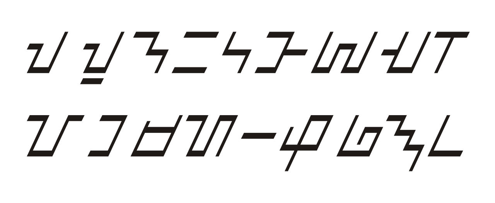

import ScriptDetails from '../../../../components/ScriptDetails.astro';
import ScriptResources from '../../../../components/ScriptResources.astro';
import WsList from '../../../../components/WsList.astro';

## Script details

<ScriptDetails />

## Script description

The Buhid script is used to write the Buhid language, spoken by about 8,000 people in the Mindoro region of the Philippines.

Read the full description...
It is an indigenous abugida script of Brahmic origin. It is proposed that the Buhid, Hanunoo and Tagbanwa scripts share common origins with the Tagalog script, an extinct script from the same region, because of the many features they have in common. All four scripts are of the abugida type, with an a vowel inherent in each consonant. The inherent vowel can be modified by the addition of a diacritic, called a _kulit_. In the Buhid script the _kulit_ takes the form of a horizontal line, added above (to produce [i]) or below (to produce [u]) the syllable, often forming a ligature. It is read horizontally, from left to right, and top to bottom.

## Languages that use this script

<WsList script='Buhd' wsMax='5' />

## Unicode status

In The Unicode Standard, Buhid script implementation is discussed in [Chapter 17 Indonesia and Oceania](http://www.unicode.org/versions/latest/ch17.pdf) under Philippine scripts.

- [Full Unicode status for Buhid](/scrlang/unicode/buhd-unicode)

## Resources

<ScriptResources detailSummary='seemore' />

