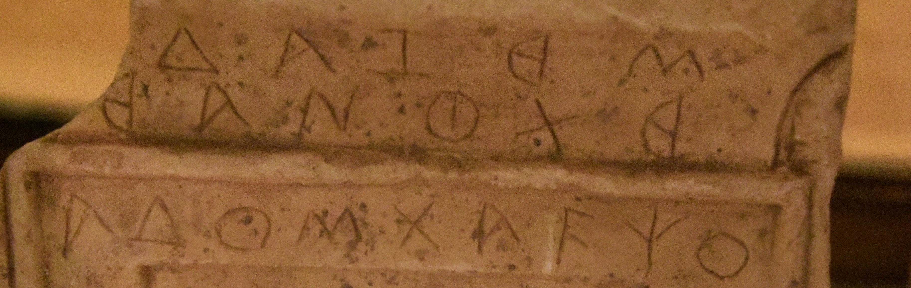

import ScriptDetails from '../../../../components/ScriptDetails.astro';
import WsList from '../../../../components/WsList.astro';
import ArticlesList from '../../../../components/ArticlesList.astro';
import SourceLinksList from '../../../../components/SourceLinksList.astro';
import BibList from '../../../../components/BibList.astro';
import Attribution from '/src/components/Attribution.astro';
import CaptionText from '/src/components/CaptionText.astro';

<CaptionText text="Limestone stela depicting a false-door, cornice above. There are Carian inscriptions. Late Period. From Saqqara, H5-873, Egypt. The Petrie Museum of Egyptian Archaeology, London. With thanks to the Petrie Museum of Egyptian Archaeology, UCL."/>
<Attribution
    type="Image"
    copyholder="Osama Shukir Muhammed Amin FRCP(Glasg)"
    copyurl=""
    copyyears="2016"
    license="CC BY-SA 4.0"
    licenseurl="https://creativecommons.org/licenses/by-sa/4.0/deed.en"
    author=""
    source="Wikipedia"
    sourceurl="https://en.wikipedia.org/wiki/File:Limestone_stela_depicting_a_false-door,_cornice_above._There_are_Carian_inscriptions._Late_Period._From_Saqqara,_H5-873,_Egypt._The_Petrie_Museum_of_Egyptian_Archaeology,_London.jpg"
/>

## Script details

<ScriptDetails />

## Script description

The Carian script was used between the 7th and 1st centuries BC in what is now the Aegean region of Turkey, for writing the Carian language.

Read the full description...
It was also used in the Nile delta, where Carians were fighting for the Egyptian pharoahs.

The script was an alphabet comprising forty-five letters. Of these, phonetic values have been assigned to nine vowels and seventeen consonants. There is some speculation as to what sounds the remaining nineteen letters represented. Visually, the letters bear a close resemblance to Greek letters. Decipherment was initially attempted on the assumption that those letters which looked like Greek represented the same sounds as their closest visual Greek equivalents. However it has since been established that the phonetic values of the two scripts are very different. For example the _theta_ θ symbol represents ‘th’ in Greek but ‘q’ in Carian.

Carian was generally written from left to right, although Egyptian writers wrote primarily from right to left. It was written without spaces between words.

## Languages that use this script

<WsList script='Cari' wsMax='5' />

## Unicode status

In The Unicode Standard, Carian script implementation is discussed in [Chapter 8 Europe-II — Ancient and Other Scripts](https://www.unicode.org/versions/latest/core-spec/chapter-8/#G26509).

- [Full Unicode status for Carian](/scrlang/unicode/cari-unicode)

## Resources

<ArticlesList tag='script-cari' header='Related articles' />

<SourceLinksList tag='script-cari' header='External links' entrytype='online' />

<BibList tag='script-cari' header='Bibliography' entrytype='non-online' />

