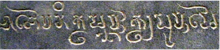
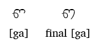
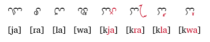

import ScriptDetails from '../../../../components/ScriptDetails.astro';
import ScriptResources from '../../../../components/ScriptResources.astro';
import WsList from '../../../../components/WsList.astro';

## Script details

<ScriptDetails />

## Script description

The Cham script is a Brahmi-derived abugida used for writing the Cham language.

Read the full description...
There are two major dialects of Cham, spoken collectively by about 230,000 people in two isolated groups in Vietnam and Cambodia, both of which once had a thriving literary tradition dating from the 8th century. The Cambodian Cham population used to be much larger, but it is estimated that up to 500,000 died as a result of the Khmer Rouge's policies in the 1970s. Under this regime the Cham were also forced to use the Cambodian language exclusively.

The script is written from left to right. The letters hang from the [baseline](/reference/glossary#baseline). Syllables in the Cham language follow a strict CV(C) pattern. Most syllable-final consonants are represented by extending the right-most stroke of the symbol as shown in the example below, but some are modified by a diacritic. One consonant character can be used at the beginning or end of the syllable without any change in form.

With the exception of nasals, each consonant contains an inherent [a] vowel. Nasal consonants inherently contain the vowel [ɨ]. In each case, the inherent vowel can be overridden by the addition of 17 vowel diacritics. Of these vowels, 6 can also take a 'full' (non-diacritical) form when they occur at the start of a syllable. The remaining 11 are represented syllable-initially by means of the independent 'a' vowel modified with the appropriate vowel diacritic.

There are four glides in the Cham phonemic inventory; these are each represented in writing with an independent symbol when they occur at the start of a syllable, but they also have a ligating form which can be added to another consonant to produce [kja], [pla], [swa] etc.

Numerals 0-9 are also represented in the Cham script.

Speakers of the Eastern and Western dialects use distinct styles of the script, with the Eastern dialect being written in a more rounded style (known as _akhăr thrah_) and the Western dialect in a more fluid style. Currently, the Cham script is used much more widely by speakers of Eastern Cham; the majority of Western Cham speakers are Muslims and use an adaptation of the Arabic script alongside Cham. In Vietnam, where the Eastern dialect is predominantly spoken, bilingual education in Vietnamese and Cham exists at primary school level, and textbooks have been published using the script.

## Languages that use this script

<WsList script='Cham' wsMax='5' />

## Unicode status

In The Unicode Standard, Cham script implementation is discussed in [Chapter 16 Southeast Asia](http://www.unicode.org/versions/latest/ch16.pdf).

- [Full Unicode status for Cham](/scrlang/unicode/cham-unicode)

Other:

- [Unicode status for Western Cham](/scrlang/unicode/z-western-cham-unicode)

## Resources

<ScriptResources detailSummary='seemore' />

