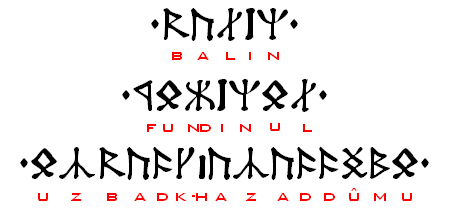

import ScriptDetails from '../../../../components/ScriptDetails.astro';
import WsList from '../../../../components/WsList.astro';
import ArticlesList from '../../../../components/ArticlesList.astro';
import SourceLinksList from '../../../../components/SourceLinksList.astro';
import BibList from '../../../../components/BibList.astro';
import Attribution from '/src/components/Attribution.astro';
import CaptionText from '/src/components/CaptionText.astro';

<CaptionText text="Balin's tomb upper inscription, set using the Angerthas font for Cirth runes."/>
<Attribution
    type="Image"
    copyholder="Rok42"
    copyurl=""
    copyyears="2005"
    license="CC BY-SA 3.0"
    licenseurl="https://creativecommons.org/licenses/by-sa/3.0/deed.en"
    author=""
    source="Wikimedia"
    sourceurl="https://commons.wikimedia.org/wiki/File:Balin_zg2.PNG"
/>

## Script details

<ScriptDetails />

## Script description

The Cirth script was created by J.

Read the full description...
R. R. Tolkien for writing the elvish and dwarvish languages spoken in the mythological world of Middle-earth. The shapes of the Cirth are based on the Futhark runes, and they are used in Middle-earth for writing inscriptions on wood and stone, in the same way that runes have been used in the real world.

Each rune generally represents one sound, and each sound is represented by one rune. Cirth was used for the Khuzdûl, Sindarin, and Quenya languages, but some signs represent different sounds in different languages, and other signs are only used in one or two of the three languages. Some of the Cirth also had two forms, which could be glyph variants in one language, but represent two different sounds in another.

The Cirth script was written from left to right with no punctuation.

## Languages that use this script

<WsList script='Cirt' wsMax='5' />

## Unicode status

The Cirth script is not yet in Unicode.

- [Full Unicode status for Cirth](/scrlang/unicode/cirt-unicode)

## Resources

<ArticlesList tag='script-cirt' header='Related articles' />

<SourceLinksList tag='script-cirt' header='External links' entrytype='online' />

<BibList tag='script-cirt' header='Bibliography' entrytype='non-online' />

