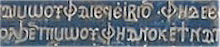

import ScriptDetails from '../../../../components/ScriptDetails.astro';
import ScriptResources from '../../../../components/ScriptResources.astro';
import WsList from '../../../../components/WsList.astro';

## Script details

<ScriptDetails />

## Script description

The Coptic alphabet is closely derived from the Greek alphabet.

Read the full description...
It is used for writing the Coptic language, which was the latest descendant of the Egyptian language and is now the liturgical language of the Coptic church. Prior to the creation of the Coptic alphabet, Egyptian was written in the Greek alphabet; prior to that, in the Demotic script. By the 1st century, spoken Egyptian had become quite removed from Demotic writing. It was also around that time that the Christian religion began spreading from Greece to Egypt. Egyptian Christians wanted a visible symbol of their new faith, and in the 3rd century the Bible was translated into the Coptic language. This translation used the Greek alphabet supplemented by Demotic symbols for representing non-Greek sounds.

The Standard Coptic script contained 32 letters, 25 from the Greek Script and 7 from the Demotic. Some dialects borrowed more or fewer letters from Demotic, to better represent their phonology. Early Coptic writing was from right to left, perhaps influenced by surrounding Semitic scripts, but later Standard Coptic was written from left to right. Vowels were not always written, although some orthographies used a small mark above the preceding consonant to indicate that the following vowel had been omitted. A small number of diacritics were used, for example to show where a syllable break occurred. Punctuation and inter-word spacing were not used.

There were several dialects of the Coptic language. The language is generally believed to have fallen from everyday use in the 16th century, and is officially classified as extinct, although there have been some reports of scattered use of spoken Coptic in ethnic Egyptian families, but these few users are not passing the language onto the next generation. Coptic is one of the two liturgical languages of the Coptic Orthodox and Coptic Catholic churches, along with Arabic, and the script is still used in this context.

## Languages that use this script

<WsList script='Copt' wsMax='5' />

## Unicode status

In The Unicode Standard, Coptic script implementation  is discussed in [Chapter 7 Europe-I — Modern and Liturgical Scripts](https://www.unicode.org/versions/latest/core-spec/chapter-7/#G16256).

- [Full Unicode status for Coptic](/scrlang/unicode/copt-unicode)

Other:

- [Unicode status for General Punctuation](/scrlang/unicode/x-gen-punct-unicode)
- [Unicode status for Combining marks](/scrlang/unicode/x-comb-marks-unicode)

## Resources

<ScriptResources detailSummary='seemore' />

