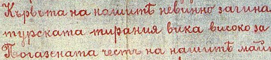

import ScriptDetails from '../../../../components/ScriptDetails.astro';
import WsList from '../../../../components/WsList.astro';
import ArticlesList from '../../../../components/ArticlesList.astro';
import SourcesList from '../../../../components/SourcesList.astro';
import Bibliography from '../../../../components/Bibliography.astro';

## Script details

<ScriptDetails />

## Script description

The creation of the Cyrillic script is traditionally attributed to Saint Cyril, a missionary working in Bulgaria during the 9th century.

Read the full description...
He and his brother are also credited with the invention of the Glagolitic script, a derivation of the Greek cursive alphabet which was modified to fit the sound systems of Slavic languages. Some historians credit Clement of Ohrid, a student of Saint Cyril's, with creating the Cyrillic script as a more readable writing system based on Glagolitic. The Cyrillic script was initially used for writing Old Church Slavonic (also called Old Bulgarian), but it has undergone a number of changes since that time, so much so that the old and modern variants are considered by many to be two different but related scripts. Many of the modern letterforms differ from those used in early Cyrillic writing, some letters have been dropped, and new letters have been added. An orthographic reform was implemented by the Russian tsar Peter the Great in 1708 which removed a number of obsolete letters so that Russian writing is now almost perfectly phonetic.

The script has traditionally been used for writing the Slavic languages, of which Russian is the most widely spoken. During the nineteenth and twentieth centuries, particularly under Soviet rule, it was extended to write over 50 languages throughout Eastern Europe and Asia.

Cyrillic is written from left to right with spaces between words. Upper- and lowercase letters are used; most printed lowercase letters are simply smaller versions of their uppercase equivalents. However, the shapes of handwritten and italic letters can vary greatly from the shapes of printed letters. With the conversion of the script to non-Slavic languages in which new sounds needed to be written, a number of [digraphs, trigraphs and tetragraphs](/reference/glossary#multig) were employed. Russian and the Slavic languages use only a few digraphs. Many new letters were also created for writing the non-Slavic languages by adding hooks, breves or diaereses to existing letters. These marks are not considered diacritics, instead, a letter so modified is considered a separate letter with the mark an intrinsic part.

After the dissolution of the Soviet Union in 1991, some of the languages which had been forced to adopt the Cyrillic script opted instead to give the Latin or Arabic script official status. However, at the end of 2002, President Putin signed into law an addition to Russian Federation law stipulating that the alphabets of the state language of the Russian Federation and the state languages of its republics must be based on the Cyrillic script.  Other scripts for the alphabets of the state language of the Russian Federation and the state languages of its republics can only be adopted under federal laws. The law was received very negatively in some states.

## Languages that use this script

:::note
Languages listed as _unwritten_ would likely use Cyrillic script if a writing system were developed. A status of _obsolete_ indicates that the writing system is no longer in use for that language; the language may still be spoken.
:::

<WsList script='Cyrl' wsMax='5' />

## Unicode status

In The Unicode Standard, Cyrillic script implementation is discussed in [Chapter 7 Europe-I: Modern and Liturgical Scripts ](https://www.unicode.org/versions/latest/core-spec/chapter-7/#G10850), [UTN 26: On the Encoding of Latin, Greek, Cyrillic, and Han](https://www.unicode.org/notes/tn26/), and in [UTN 41: Church Slavonic Typography in Unicode](https://www.unicode.org/notes/tn41/).

- [Full Unicode status for Cyrillic](/scrlang/unicode/cyrl-unicode)

Other:

- [Unicode status for General Punctuation](/scrlang/unicode/x-gen-punct-unicode)
- [Unicode status for Currency](/scrlang/unicode/x-currency-unicode)
- [Unicode status for Combining marks](/scrlang/unicode/x-comb-marks-unicode)

## Resources

<ArticlesList tag='script-cyrl' header='Related articles' />

<SourcesList tag='script-cyrl' header='External links' />

<Bibliography tag='script-cyrl' header='Bibliography' />

