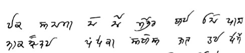

import ScriptDetails from '../../../../components/ScriptDetails.astro';
import ScriptResources from '../../../../components/ScriptResources.astro';
import WsList from '../../../../components/WsList.astro';

## Script details

<ScriptDetails />

## Script description

The Dogra or Dogri script is a Brahmi-based alphasyllabary that is written from left to right.

Read the full description...
Independent and initial vowels are written using letters, while dependent vowels are expressed using combining signs. Consonant letters possess the inherent vowel _a_, which is changed by the attachment of a vowel sign. Consonant clusters are written in various ways, such as with visible _halanta_, as an atomic ligature, and with half-forms; _repha_ is attested, but rarely used. There are no formal conventions regarding representation of conjuncts.

## Languages that use this script

:::note
A status of _obsolete_ indicates that the writing system is no longer in use for that language; the language may still be spoken.
:::

<WsList script='Dogr' wsMax='5' />

## Unicode status

In The Unicode Standard, Dogra script implementation is discussed in [Chapter 15: South and Central Asia-IV — Other Historic Scripts](https://www.unicode.org/versions/latest/core-spec/chapter-15/#G100066).

- [Full Unicode status for Dogra](/scrlang/unicode/dogr-unicode)

## Resources

<ScriptResources detailSummary='seemore' />

