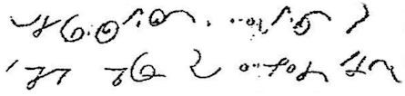

import ScriptDetails from '../../../../components/ScriptDetails.astro';
import ScriptResources from '../../../../components/ScriptResources.astro';
import WsList from '../../../../components/WsList.astro';

## Script details

<ScriptDetails />

## Script description

Duployan Shorthand (also called Sloan-Duployan Shorthand, or Duployan Stenography) was first created in 1860 by Emile Duployé, as a stenographic shorthand for rapidly writing French.

Read the full description...
It was also adapted for writing English, German, Spanish, and Romanian.

Around 1879, a Catholic priest, Father Jean-Marie Raphaël Le Jeune, who had learned Duployan Stenography in France, went to British Columbia to work as a missionary among the Chinook. The Chinookan language family is made up of several closely related languages, many of which are now extinct or severely endangered. One of these, a creole called Chinook Jargon, is still spoken by a few small communities in Oregon. Father Le Jeune became frustrated with the inefficiency of the Roman alphabet for writing the Chinook languages, in particular Chinook Jargon, and adapted and augmented Duployan Shorthand for this purpose. In the 1890s, he published the Kamloops Wawa, a newspaper published in Chinook Jargon. Some sources treat Duployé's shorthand and Father Le Jeune's augmented version for Chinook Jargon as two different scripts.

Around the same time, Denis-Romulus Perrault, a stenographer from Montreal, was applying Duployan Shorthand to a number of First Nations languages spoken in modern-day Quebec and Newfoundland. The exact languages which Perrault expressed in Shorthand is unknown, however the script is currently used for writing the Okanagan, Lillooet, Shushwap and North Thompson languages of interior British Columbia, as well as Chinook Jargon.

Duployan Shorthand is an alphabet, representing both consonants and vowels. In general, consonants are written using straight lines or curved arcs, and have invariable orientation (that is, they do not rotate to match the surrounding letters). Vowel letter-shapes tend to be based on circles and semi-circles, and can be rotated or reshaped to fit the context.

The script is used slightly differently for different languages, having been augmented with extra symbols to represent the phonologies of each language. For example, Chinook writing also contains compound consonant letters and a logograph. Some languages also use variant forms of the core letter set, including letters with ancillary diacritics and size variants.

Duployan Shorthand is written in a cursive style from left to right. It has been praised for its simplicity and the speed with which it can be written.

## Languages that use this script

<WsList script='Dupl' wsMax='5' />

## Unicode status

In The Unicode Standard, Duployan Shorthand implementation is discussed in [Chapter 21 Notational Systems: Shorthands, Braille, Musical Symbols](http://www.unicode.org/versions/latest/ch21.pdf).

- [Full Unicode status for Duployan](/scrlang/unicode/dupl-unicode)

## Resources

<ScriptResources detailSummary='seemore' />

