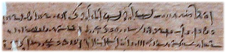

import ScriptDetails from '../../../../components/ScriptDetails.astro';
import ScriptResources from '../../../../components/ScriptResources.astro';
import WsList from '../../../../components/WsList.astro';

## Script details

<ScriptDetails />

## Script description

The Egyptian Demotic script was used from about 600 BC to about 400 AD for writing the Egyptian language.

Read the full description...
Demotic writing descended from Egyptian Hieratic writing, the manuscript writing system which was used alongside Hieroglyphics, and it was later used in place of both of these scripts. The development of the Demotic script is generally divided into three periods, Early, Middle (Ptolemaic) and Late (Roman). Demotic was mostly written on papyrus, embalming fabric and other soft surfaces, but was sometimes also inscribed in stone, the most famous example being the middle section of the Rosetta Stone. Initially the script was used primarily in an administrative context; later it came to be used for literary and religious texts also. It was gradually supplanted by the Coptic alphabet from 300 AD onwards.

Egyptian Demotic was a cursive script, written from right to left. It was similar in form to hieroglyphic and hieratic writing, in that it used a combination of logographic and phonetic signs. It reproduced many of the same shapes of the pictographs of the earlier scripts, in a more cursive form which no longer necessarily resembled the concepts/objects they represented. New words for which there was no pre-existing sign were spelled using phonetic symbols.

## Languages that use this script

<WsList script='Egyd' wsMax='5' />

## Unicode status

No proposal for the inclusion of Egyptian Demotic in the Unicode Standard has been submitted as of version 6.0 of the Standard.

- [Full Unicode status for Egyptian Demotic](/scrlang/unicode/egyd-unicode)

## Resources

<ScriptResources detailSummary='seemore' />

