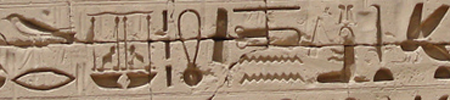

import ScriptDetails from '../../../../components/ScriptDetails.astro';
import ScriptResources from '../../../../components/ScriptResources.astro';
import WsList from '../../../../components/WsList.astro';

## Script details

<ScriptDetails />

## Script description

Egyptian hieroglyphics were used for writing the Egyptian language from about 3000 BC until 400 AD.

Read the full description...
Symbols resembling hieroglyphs had been used by artisans in the region since 4000 BC, but with no ascertainable linguistic content. The first hieroglyphs were used for making inscriptions on buildings and tombs. Later they came to be used to decorate jewelry, record events on papyrus and to put a royal or divine signature, called a _cartouche_ on an item.

The Egyptian hieroglyphic system of writing consisted of both phonetic symbols and pictographs. There were about 30 symbols representing single consonants, plus about 130 bilateral and trilateral symbols which represented two or three consonants. For example, the heart-with-trachea symbol represented the consonants n + f + r, pronounced _nefer_. Some symbols were used as phonetic complements, which reinforced the final consonant in a bi- or trilateral symbol. Vowels were not written. Pictograms were symbols which visually resembled the item or concept they represented. In total there were an estimated 7000 pictograms, but these were not all in use at the same time.

Some symbols could be used either as a pictogram or as a phonetic symbol. For example, a rectangular spiral represented both the sound [pr], and the concept of a house. Combined with the fact that vowels were not written, this resulted in some symbols or combinations of symbols having multiple possible meanings. To indicate which meaning was intended, a third class of symbol, called _determinatives_, was used. Often, a small vertical stroke underneath the symbol was used to indicate that the object/concept - rather than the phonetic - interpretation was intended. Another example of a determinative was a pictogram of a pair of legs to indicate that the preceding symbol was a verb of movement.

Egyptian hieroglyphic writing did not use any punctuation or word spacing. Symbols were arranged either in vertical columns or horizontal rows, and could be read from right to left or from left to right. In order to demonstrate in which direction the text had been written, the scribe would orientate any animate pictograms (that is, symbols in the shape of a human or animal) to face in the intended direction of reading.

## Languages that use this script

:::note
A status of _obsolete_ indicates that the writing system is no longer in use for that language; the language may still be spoken.
:::

<WsList script='Egyp' wsMax='5' />

## Unicode status

In The Unicode Standard, implementation of Egyptian Hieroglyphs is discussed in [Chapter 11 Cuneiform and Hieroglyphs](https://www.unicode.org/versions/latest/core-spec/chapter-11/#G26607), [UTN 32: Mapping Between Manuel de Codage and Unicode Egyptian Hieroglyphs](https://www.unicode.org/notes/tn32/), and in [Unicode Egyptian Hieroglyph Database (Unikemet)](https://www.unicode.org/reports/tr57/).

- [Full Unicode status for Egyptian Hieroglyphs](/scrlang/unicode/egyp-unicode)

Other:

- [Unicode status for General Punctuation](/scrlang/unicode/x-gen-punct-unicode)

## Resources

<ScriptResources detailSummary='seemore' />

