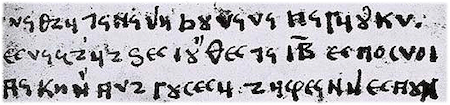

import ScriptDetails from '../../../../components/ScriptDetails.astro';
import ScriptResources from '../../../../components/ScriptResources.astro';
import WsList from '../../../../components/WsList.astro';

## Script details

<ScriptDetails />

## Script description

The Elbasan script was created by Albanian Christians in the mid-18th century.

Read the full description...
It is known primarily from its use in the Elbasan Gospel Manuscript, the second-oldest manuscript in Albania.

Elbasan was an alphabet written from left to right. Forty letters were used, influenced in part by the Greek and Slavic scripts, but largely novel creations. It is thought that the Greek system of marking certain letters with an overline to indicate a numeric value was also used by Elbasan writers. 

Elbasan is no longer used, the Latin alphabet having been standardized for Albanian in 1909.

## Languages that use this script

<WsList script='Elba' wsMax='5' />

## Unicode status

In The Unicode Standard, Elbasan script implementation is discussed in [Chapter 8 Europe-II — Ancient and Other Scripts](https://www.unicode.org/versions/latest/core-spec/chapter-8/#G27032).

- [Full Unicode status for Elbasan](/scrlang/unicode/elba-unicode)

## Resources

<ScriptResources detailSummary='seemore' />

