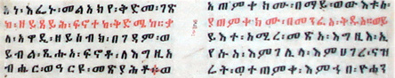

import ScriptDetails from '../../../../components/ScriptDetails.astro';
import ScriptResources from '../../../../components/ScriptResources.astro';
import WsList from '../../../../components/WsList.astro';

## Script details

<ScriptDetails />

## Script description

The Ethiopic (Ge'ez) script was developed as the writing system of the Ge'ez language, a Semitic language spoken in Ethiopia and Eritrea until the 10th to the 12th centuries.

Read the full description...
Although the language ceased to be used in vernacular speech (it now serves a liturgical function only), the script is still widely used for writing the Ethiopian and Eritrean Semitic languages such as Tigré, Amharic and Tigrinya. In some languages, the script is called _fidäl_ (ፊደል), which means 'alphabet', and individual letters are referred to as _fidel_. The script is believed by many to have derived from the epigraphic South Arabian script, of Proto-Sinaitic heritage, although there is some dispute surrounding this assertion; some also believe it to have descended from Egyptian hieroglyphics. According to the tradition of the Ethiopian Orthodox Tewahedo Church, the script was divinely revealed to Enos, grandson of the first man, Adam. Unlike other Semitic scripts, Ethiopic is written from left to right.

The original Ge'ez script was an abjad - vowels were not written - but the current script is classified as an abugida. Each symbol represents a CV syllable, but vowels are not inherent in the consonant. The original Ethiopic script contained 182 characters, although the basic (unmarked) consonants number only 26. The script has since been extended for other languages and now contains over 500 symbols. Some of the new symbols represent phonological processes such as palatalization, pharyngealization and labialization.

The unmarked set is known as the first order (also called the first form). Each of the first order consonants can be combined with one of six vowels, to produce a syllograph. The resulting sets of syllographs are known as the second, third, fourth, fifth, sixth and seventh orders. In some languages there is an additional vowel symbol which can be combined with the first order consonants to produce an eighth order.

[comment]: # (  )

As shown in the chart, the way in which consonant characters are combined with vowel signs often follows a general pattern, particularly in the second to sixth orders, but it is by no means fully systematic. This has sometimes resulted in the creation of a new character, unrelated in form to the unmarked consonant. For this reason, in tables of Ethiopic letters, all 182 characters tend to be displayed, unlike tables of Brahmic abugidas which combine consonants and vowels in a predictable manner. 

The script does not completely represent some languages. For example, [gemination](/reference/glossary#gemination) (consonant lengthening) is generally not represented in the orthography, despite being distinctive in speech. Conversely, some distinctions in the Amharic orthography are no longer significant in speech, for example, the difference between [h], [ħ] and [x] is only etymologically significant in spoken Amharic but continues to be represented in the orthography.

[comment]: # (  )

The conventional ordering of the consonants differs from that of other Semitic scripts; the reasons for this are unclear although it is speculated that the ordering is reminiscent of that used for the ancient Sabean script, a South Semitic predecessor of Ge'ez.

## Languages that use this script

:::note
Languages listed as _unwritten_ would likely use Ethiopic script if a writing system were developed. A status of _obsolete_ indicates that the writing system is no longer in use for that language; the language may still be spoken.
:::

<WsList script='Ethi' wsMax='5' />

## Unicode status

In The Unicode Standard, Ethiopic script implementation is discussed in [Chapter 19 Africa](http://www.unicode.org/versions/latest/ch19.pdf).

- [Full Unicode status for Ethiopic](/scrlang/unicode/ethi-unicode)

## Resources

<ScriptResources detailSummary='seemore' />

