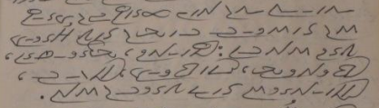

import ScriptDetails from '../../../../components/ScriptDetails.astro';
import ScriptResources from '../../../../components/ScriptResources.astro';
import WsList from '../../../../components/WsList.astro';

## Script details

<ScriptDetails />

## Script description

The Garay (also called Wolof) alphabet was created by Assane Faye in 1961 for writing the Wolof language, spoken in Senegal.

Read the full description...
The script is written from right to left using twenty-five consonant letters (including a ‘vowel-carrier’), four basic vowel signs, a vowel-length mark, a zero-vowel mark, and a gemination sign. Each consonant has an initial and a non-initial form.

It is unknown whether the script is in use; the Wolof language is normally written with the [Latin](/scrlang/scripts/latn) script. Charles Riley conducted a research trip to Senegal in 2009, during which time he met with Assane Faye and visited his home. He reported that Assane Faye had been offering lessons in the script to hundreds of people over the years, translated the Koran using it, and had a house filled with dozens of unpublished handwritten texts.

## Languages that use this script

<WsList script='Gara' wsMax='5' />

## Unicode status

In The Unicode Standard, Garay Script implementation is discussed in [Chapter 19 Africa](https://www.unicode.org/versions/latest/core-spec/chapter-19/#G746355).

- [Full Unicode status for Garay](/scrlang/unicode/gara-unicode)

## Resources

<ScriptResources detailSummary='seemore' />

