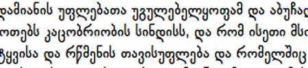

import ScriptDetails from '../../../../components/ScriptDetails.astro';
import WsList from '../../../../components/WsList.astro';
import ArticlesList from '../../../../components/ArticlesList.astro';
import SourcesList from '../../../../components/SourcesList.astro';
import Bibliography from '../../../../components/Bibliography.astro';

## Script details

<ScriptDetails />

## Script description

The Georgian language is spoken by approximately 3,900,000 people in Georgia, as well as by 355,000 people in Azerbaijan, Turkey and Iran.

Read the full description...
The earliest uncontested inscription in the language dates from the 5th century. Since that time, Georgian has been written in three distinct scripts. The original script was an inscriptional form called _Asomtavruli_, from which a manuscript form, _Nuskhuri_, was derived. For a time, these were combined in a [bicameral](/reference/glossary#bicam) system called _Khutsuri_ in which Asomtavruli letters were used as the upper case and Nushkuri as the lower case. Since the 11th century, a third script has been attested, called _Mkhedruli_. There is some debate as to the origins of this third script; some scholars say that it evolved from the Khutsuri system, other, that it pre-dates it. What is generally agreed upon is that Mkhedruli was used as a secular script alongside the ecclesiastical Khutsuri until the 18th century, since which time it has been used for nearly all Georgian writing. The three scripts share the same letter names, despite having different letter shapes.

The Mkhedruli alphabet is also used for writing the Mingrelian and Svan languages spoken in Georgia, as well as Laz, spoken in Turkey.

There are 33 Mkhedruli letters currently used for writing Georgian, plus another 8 which are now obsolete. There is an almost exact one-to-one mapping between sounds and letters, that is, every sound is written and (almost) every letter is pronounced. The exceptions to this are the letters representing [m], [r] and [l], which are sometimes written but not pronounced, due to phonological processes such as lenition (the weakening of a consonant, which can lead to its not being pronounced at all). The letters representing [h] and [s] are also written but not pronounced in some contexts where they serve as grammatical markers in a grammatical rule which is undergoing change. The order of the letters roughly follows that of the Greek alphabet, with some influence from early Iranian scripts such as Pahlavi.

Georgian writing currently uses only one case, although previous alphabets have been bicameral. There have been some attempts, notably on the part of Akaki Shanidze, to use the letters of the old Asomtavruli alphabet as upper-case letters, but this system is unofficial and has been used very sporadically. It is read from left to right, with spaces between words and a punctuation mark to indicate the end of sentences. No diacritics are used. Within a word, letters can be spaced out to add emphasis. In printed texts, letters are not connected in any way, but handwriting can be cursive and involve a number of ligatures.

Letters are written on a bottom [baseline](/reference/glossary#baseline), with descenders extending below the baseline and ascenders extending above the x-height. Five letters have both ascenders and descenders. Titles and headings  are customarily written with letters which are normally at the x-height being extended to the height and depth of the ascenders and descenders, so that all the letters are of uniform height. These are not encoded as distinct letters, rather they comprise a font style, similar to Latin small caps, which is known as _Mtavruli_.

## Languages that use this script

:::note
A status of _obsolete_ indicates that the writing system is no longer in use for that language; the language may still be spoken.
:::

<WsList script='Geor' wsMax='5' />

## Unicode status

In The Unicode Standard, Georgian script implementation is discussed in [Chapter 7 Europe-I — Modern and Liturgical Scripts](https://www.unicode.org/versions/latest/core-spec/chapter-7/#G3360).

- [Full Unicode status for Georgian](/scrlang/unicode/geor-unicode)

Other:

- [Unicode status for Currency](/scrlang/unicode/x-currency-unicode)

## Resources

<ArticlesList tag='script-geor' header='Related articles' />

<SourcesList tag='script-geor' header='External links' />

<Bibliography tag='script-geor' header='Bibliography' />
