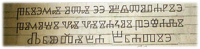

import ScriptDetails from '../../../../components/ScriptDetails.astro';
import ScriptResources from '../../../../components/ScriptResources.astro';
import WsList from '../../../../components/WsList.astro';

## Script details

<ScriptDetails />

## Script description

The Glagolitic script, also known as Glagolitsa and Asbuka, is the earliest known Slavic alphabet.

Read the full description...
The name Glagolitic comes from the Old Slavic word _glagol_, meaning _word_. The origins of the script are not clear; two opposing views claim that it was either created by a single individual (most popularly cited as Constantine/St. Cyril), or that it was derived from Greek cursive forms and was already in use by the time St. Cyril arrived in the area. Cubberley suggests in 'The Slavic Alphabets' that the Slavs themselves created the script based on Greek cursive letters a few centuries before St Cyril and St Methodius' mission in 860, and that St. Cyril formalized the system and added some new letters based on Coptic, Hebrew or Armenian forms, to represent sounds not found in Greek. What is known is that Glagolitic writing was used throughout the Balkans in tandem with Cyrillic until the 13th century, after which time it was largely replaced by Cyrillic. In Croatia, Glagolitic continued to be used until the 19th century, particularly in the church, and is still used in a limited way on the island of Krk.

The order of the alphabet basically follows the Greek order, with the additional non-Greek letters appended at the end. The script underwent a number of gradual changes during the course of its use, and as a result there are two main variants known as 'round' and 'square'. The round form is the older of the two and was used throughout a wider geographical area, although fewer examples of it have survived. The square form (also sometimes called Croatian Glagolitic) was used from the 13th to the 19th century in Croatia, where it is still used for decorative purposes, especially on the island of Krk. Due to the gradual and constant development of the script, the exact number of letters is unknown; many documents contain letters which have not been found elsewhere.

The script is read from left to right. It uses upper and lower case; the lower case set is almost entirely a smaller version of the upper case set. Later documents written in Croatian Glagolitic make use of literally hundreds of ligatures, in which two letters are joined to create a new letter, and of 'broken ligatures', in which half of a letter may be joined to another to create a new letter. There are no contextual changes in the forms of letters. The Unicode Standard 5.0 encodes 44 upper case and 44 lower case symbols in the round form of the script, a few of each case being variants of the same letter. Ligatures are not encoded separately.Glagolitic uses Latin commas and full stops, as well as semicolons as question marks, colons as alternative full stops, a middle dot to indicate numeric use of the letter, and a three-dot mark to separate paragraphs. There are no separate numbers, but numerical values are assigned to letters, indicated by a middle dot flanking the symbol on both sides, or by a macron or tilde over it. A tilde can also be written over abbreviated words. Round Glagolitic hangs from the [baseline](/reference/glossary#baseline).

## Languages that use this script

:::note
A status of _obsolete_ indicates that the writing system is no longer in use for that language; the language may still be spoken.
:::

<WsList script='Glag' wsMax='5' />

## Unicode status

In The Unicode Standard, Glagolitic script implementation is discussed in [Chapter 7 Europe-I — Modern and Liturgical Scripts](https://www.unicode.org/versions/latest/core-spec/chapter-7/#G15862).

- [Full Unicode status for Glagolitic](/scrlang/unicode/glag-unicode)

Other:

- [Unicode status for General Punctuation](/scrlang/unicode/x-gen-punct-unicode)
- [Unicode status for Combining marks](/scrlang/unicode/x-comb-marks-unicode)

## Resources

<ScriptResources detailSummary='seemore' />

