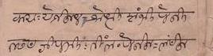

import ScriptDetails from '../../../../components/ScriptDetails.astro';
import ScriptResources from '../../../../components/ScriptResources.astro';
import WsList from '../../../../components/WsList.astro';

## Script details

<ScriptDetails />

## Script description

The Gunjala Gondi script, also known as Koytura Gunjala Lipi, is named after the village of Gunjala in the Indian state of Telangana (formerly part of Andhra Pradesh) where manuscripts written in the script were recently found.

Read the full description...
The script is used to write the Gondi language and is distinct from the [Masaram Gondi](/scrlang/scripts/gonm) script designed in 1928 by Munshi Mangal Singh Masaram.

Gunjala Gondi manuscripts have been dated to 1750 and reference events as early as the 6th and 7th centuries.  The script is cursive, hand-written sources showing syllables of a word connected using pen strokes.  It does not appear to be genetically related to other scripts, although it strongly resembles the [Modi](/scrlang/scripts/modi) script in appearance and style.  Whilst the vowel order follows the Brahmi pattern, the consonant order does not, starting with _ya_, rather than the usual _ka_.  Vowel signs and modifiers are placed to the right of the consonant or above the head-stroke at the right edge.

Gunjala Gondi is currently undergoing something of a revival.  Professor Jayadhir Tirumal Rao, who has researched the script is quoted as saying:“Andhra Pradesh has 34 tribal communities and none of them has a script except the Gondi community. The script is their self-esteem and we took up the task of preserving it by reviving the language.”.  Teaching materials have been developed in the script and it is being taught in a number of schools in villages with a high Gond population.

## Languages that use this script

<WsList script='Gong' wsMax='5' />

## Unicode status

In The Unicode Standard, Gunjala Gondi script implementation is discussed in [Chapter 13: South and Central Asia-II — Other Modern Scripts](https://www.unicode.org/versions/latest/core-spec/chapter-13/#G39306).

- [Full Unicode status for Gunjala Gondi](/scrlang/unicode/gong-unicode)

## Resources

<ScriptResources detailSummary='seemore' />

