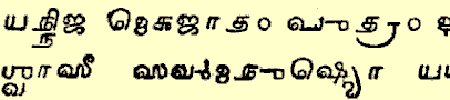

import ScriptDetails from '../../../../components/ScriptDetails.astro';
import ScriptResources from '../../../../components/ScriptResources.astro';
import WsList from '../../../../components/WsList.astro';

## Script details

<ScriptDetails />

## Script description

The Grantha script was designed for writing sacred texts in the Sanskrit language.

Read the full description...
The script is thought to be based on the stone-age cave inscriptions from the Chera dynasty, and to have gone through three stages of development; Early, Middle and Modern. The only examples of Early or Middle Grantha are from odd words interspersed with Tamil in inscriptions. The earliest inscription written entirely in Grantha has been dated to 1383, and is written in the most modern form of the script.

There are two main branches of Modern Grantha; East Grantha and Tulu-Malayalam (also called West Grantha). Eastern Grantha was written in the state of Tamil Nadu in two distinct hands; a Brahmanical (square) variety used in Tanjore province, and a Jain (round) variety used around Arcot and Chennai. Tulu-Malayalam writing is still taught and used in _Gūrūkuls_, residential Hindu schools. It preserves some of the older letter forms which were later modified in Eastern varieties of the script. Aside from its use in the Gūrūkuls, it is also used by Tamil-speaking Hindus to write a child's name for the first time during the naming ceremony, to write the Sanskrit portion of wedding invitations and for announcements of a person's last rites. It is also used in many religious almanacs to print traditional formulaic summaries of the coming year. 

There was a third variety of the script called Tamil Grantha which was used in the 5th and 6th centuries for writing both Tamil and Sanskrit.

Grantha is an abugida, written from left to right. Each letter represents either a vowel or a consonant+vowel syllable in which the default vowel is [ə], unless diacritics are used to indicate otherwise. There are 14 vowel letters,  34 consonant+[ə] letters and 13 vowel diacritics. There are also 3 subsidiary consonant letters used for writing consonant clusters containing _y_ or _r_. One of these letters represents [j(ə)], one represents pre-consonantal [r] and one represents post-consonantal [rə]. Other consonant clusters were written using conjuncts; the preference was to stack these vertically rather than align them linearly. The symbols _anusvara_ and _visarga_ were used as in a number of South Asian scripts for representing nasalization and voiceless breath respectively.

The Grantha script employed a set of numerals 0-10, 100 and 1000 which were arranged linearly so that the number 21, for example, was written using the symbols for 2, 10 and 1 (2x10+1). A particular feature of the Grantha numeral system was their system of writing fractions. These were written using distinct symbols representing fractions of 320. So what is written in the Latin script as 1/4, for example, was written in Grantha using a single symbol read as 80/320. Distinct symbols only existed for some fractions, but composites could be created; there was a symbol representing 8/320 and a symbol representing 1/320, so 9/320 was written using both symbols.

## Languages that use this script

<WsList script='Gran' wsMax='5' />

## Unicode status

In The Unicode Standard, Grantha script implementation is discussed in [Chapter 15: South and Central Asia-IV — Other Historic Scripts](https://www.unicode.org/versions/latest/core-spec/chapter-15/#G81052).

- [Full Unicode status for Grantha](/scrlang/unicode/gran-unicode)

Other:

- [Unicode status for Vedic](/scrlang/unicode/x-vedic-unicode)

## Resources

<ScriptResources detailSummary='seemore' />

