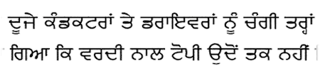
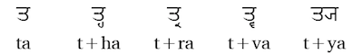
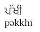

import ScriptDetails from '../../../../components/ScriptDetails.astro';
import ScriptResources from '../../../../components/ScriptResources.astro';
import WsList from '../../../../components/WsList.astro';

## Script details

<ScriptDetails />

## Script description

The Gurmukhi script is used primarily by followers of the Sikh religion in India to write the Punjabi language.Gurmukhi writing is historically derived from Brahmi, but its present form was developed in the 16th century by Guru Angad, successor to the founder of the Sikh religion, Guru Nanak. The word Gurmukhi means 'from the mouth of the guru'. Muslims in the Pakistani Punjab write Punjabi in the Persian script; use of the Persian script for writing Punjabi is called _Shahmukhi_.

Gurmukhi is written from left to right using letters that hang from a horizontal headstroke. The script is an abugida, that is, each letter represents a consonant with an inherent [ə] vowel. There are thirty-two basic consonant letters, which are ordered according to the place and manner in which the sound is produced, in the same way as the Devanagari letters. Consonants are ordered in rows; velar, palatal, retroflex, dental, labial. Within each row, voiceless sounds are ordered first (unaspirated and aspirated), then voiced sounds (historically unaspirated and aspirated, although this distinction has been lost in modern spoken Punjabi), and lastly nasals. Sonorants are ordered last.

Consonants can be modified using one of nine vowel diacritics to change the inherent vowel. The script does not use any independent vowel letters; syllable-initial vowels are written using one of three vowel carriers, one each for back, low and front vowels, and the appropriate diacritic. Six consonant letters can be modified with a dot to represent a (usually) non-native sound, for example ਫ represents [phə] but ਫ਼ represents [fə]. Consonant clusters in which [h], [r] or [w] is the second element can be written using a conjunct. These three letters have 'half-forms' which can be subjoined to the full form of another consonant. Consonant clusters in which [y] is the second element are also written with a half-form of the letter _ya_, but the two elements are not joined into a ligature.

There are two symbols for indicating nasalization. In general, _tippi_  ੰ is written above the vowels _a_, _i_, _u_ and _ū_ in final position, and _biṃdī_  ਂ is used in all other contexts. There is also a sign _addak_  ੱ for representing [gemination](/reference/glossary#gemination) (long consonants), which is written above and to the left of the consonant to be lengthened. This sign is also used for writing a cluster of an unaspirated and homorganic (pronounced in the same place) aspirated stop; in this case only the aspirated letter is written and _addak_ is written above and to the left of it, as in the word [pəkkhī] 'ripe', which is written _pə_ + _addak_ + _khə_ + _ī_.

The Punjabi language has a three-way tone system of high, mid and low tones. There are no specific tone marks in Gurmukhi writing, but certain aspects of the orthography carry information about tones. In word-initial position, a historically voiced aspirate is pronounced as a voiceless non-aspirate, and indicates that the following vowel carries a low tone. For example, the word written as _ghaṛ_ is pronounced [kàṛ] ('house'). In word-final position, the same letters are pronounced as voiced non-aspirates, and indicate that the preceding vowel carries a high tone. for example the word written as _kujh_ is pronounced [kúj] ('something'). The letter _ha_ has a special role in marking tone. At the start of a word it carries no tone information but represents the sound [hə], but written elsewhere in a word it carries no phonetic value but represents high tone on the preceding vowel. For example, the word written as _tīh_ is pronounced [tí] ('thirty'). When the letter _ha_ follows a short _i_ or _u_, it changes their phonetic value from [ɪ] and [ʊ] to [é] and [ó] respectively, and indicates high tone.

The Gurmukhi script employs a set of numerals from 0-9. These are becoming less widespread as they are being replaced by Latin numerals, but are still in common use. Latin punctuation is used, as well as the _danda_ and _double danda_ symbols which are commonly used in the Brahmic scripts to mark the end of a sentence or verse.

## Languages that use this script

:::note
A status of _obsolete_ indicates that the writing system is no longer in use for that language; the language may still be spoken.
:::

<WsList script='Guru' wsMax='5' />

## Unicode status

In The Unicode Standard, Gurmukhi script implementation is discussed in [Chapter 12 South and Central Asia-I — Official Scripts of India](https://www.unicode.org/versions/latest/core-spec/chapter-12/#G668388), [UTN 25: Gurmukhi Character Names](https://www.unicode.org/notes/tn25/), and in [UTN 30: ISCII to Unicode Conversion Issues for Gurmukhi](https://www.unicode.org/notes/tn30/).

- [Full Unicode status for Gurmukhi](/scrlang/unicode/guru-unicode)

Other:

- [Unicode status for Vedic](/scrlang/unicode/x-vedic-unicode)

## Resources

<ScriptResources detailSummary='seemore' />

