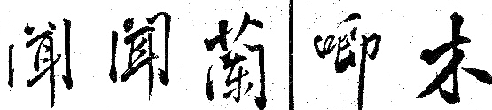

import ScriptDetails from '../../../../components/ScriptDetails.astro';
import ScriptResources from '../../../../components/ScriptResources.astro';
import WsList from '../../../../components/WsList.astro';

## Script details

<ScriptDetails />

## Script description

The Han script comprises three systems; when used for writing the languages of China the characters are called _hanzi_, the same characters used for writing Japanese are called _kanji_, and for Korean, _hanja_.

Read the full description...
It is commonly assumed that the Sinitic languages (Chinese languages) are monosyllabic, and that one written character = one syllable = one word. However, there are many polysyllabic words in both the ancient and modern lexicons, and the average length of a word in Mandarin is two syllables. These words are represented using combinations of characters, each representing one syllable. There are some exceptions to this rule, in the form of unofficial but widely used single characters representing polysyllabic Chinese words, such as _túshūguăn_ 'library' and _wèntí_ 'question'. This is common when the characters are used for writing Japanese, due to different phonological rules governing the language. A single character may frequently represent a polysyllabic word in Japanese and some of the other languages for which Han characters are used.

Chinese writing is believed to be the oldest form of writing in East Asia, having apparently been spontaneously created during the second half of the second millenium BC. There is no evidence of any other writing in use in the area at this time, nor of any outside influence from a literate society. The earliest inscriptions were on bones and shells used in divination during the Shang dynasty (1600-1046 BC), and employed a set of logographic symbols now known as the Oracle Bone Script. Although these symbols have been extinct since the end of the Bronze Age, the modern Han characters are direct descendants from these.

Han writing is still sometimes referred to as logographic, but most linguists and sinographers (scholars of Chinese) agree that the script might be best described as a phonetically imprecise syllabary with strong semantic qualities. The script functions differently from a purely phonetic script such as an alphabet in that a single character can regularly carry semantic weight in and of itself without needing to be combined with other elements. In addition, the same sound can be represented by different symbols. For example, the word _yī_ is the Modern Standard Mandarin pronunciation of the words meaning 'one', 'clothing', 'depend on', and regional pronunciations of 'he/she', but each of these is represented by a different character. It may be that in earlier varieties of the language these words were pronounced differently but over time have collapsed into a single sound.

There have been numerous attempts to classify Han characters by phonetic rather than semantic criteria, notably, Berhnard Karlgren's work in the 1920s-40s and Zhou Youguang's in the 1970s. Most attempts have identified 850-1250 phonetic elements. Although the characters are made up of recurring phonetic components, their shapes and proportions change in combination, so each character is a discrete entity and must be stored as such in the user's memory or in a font. There are estimated to be 60,000 Han characters comprising the full set, but a competent grasp of approximately 2,500 characters is considered by educators to be essential for basic reading and writing skills, and about 5,200 characters are estimated to account for over 99% of the characters used in typical texts. The _Xīnhuá zìdiăn_ (New China Character Dictionary) lists 8,075 characters. The canonical order of signs arranges them according to semantic classifications ranging from specific to general; signs related to mankind, minerals, height etc.

There are two styles of Han characters used for writing Chinese and the languages of China; the traditional forms used throughout the Chinese-speaking world from the 5th century AD until 1949, and the simplified forms which replaced them in the People's Republic of China and Singapore since 1949. Traditional Han is still used in Taiwan, Hong Kong and Macau, and for aesthetic purposes elsewhere in East Asia.

## Languages that use this script

:::note
A status of _obsolete_ indicates that the writing system is no longer in use for that language; the language may still be spoken.
:::

<WsList script='Hani' wsMax='5' />

## Unicode status

In The Unicode Standard, Han implementation is discussed in [Chapter 18 East Asia](http://www.unicode.org/versions/latest/ch18.pdf).

- [Full Unicode status for Han](/scrlang/unicode/hani-unicode)

Other:

- [Unicode status for Currency](/scrlang/unicode/x-currency-unicode)

## Resources

<ScriptResources detailSummary='seemore' />

