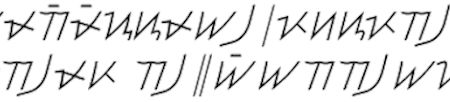
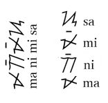

import ScriptDetails from '../../../../components/ScriptDetails.astro';
import WsList from '../../../../components/WsList.astro';
import ArticlesList from '../../../../components/ArticlesList.astro';
import SourceLinksList from '../../../../components/SourceLinksList.astro';
import BibList from '../../../../components/BibList.astro';

## Script details

<ScriptDetails />

## Script description

The Hanunóo script is used by the Mangyan people in the mountains of Mindoro, South Philippines, to write the Hanunóo language.Perhaps due to its inaccessible location, it is one of the few indigenous Philippine scripts which has not been replaced by the Latin script. It is of Brahmic origin, descended through Old Kawi, although its history is difficult to trace in detail due to the perishable nature of bamboo, the surface on which it is traditionally inscribed. The script is an abugida, in which each of the 15 consonants has an inherent [a] vowel. The other two vowels in the inventory, [i] and [u], are marked syllable-finally by a diacritic positioned above or below (or to the left or right of) the syllable, often forming a ligature. There are also three vowel characters representing syllable-initial [a], [i], or [u]. Hanunóo words are predominantly disyllabic, and tend to be in CVCV form, although CVC syllables are also possible. In the case of a CVC syllable, the final consonant is often not written, so the reader must determine from context the correct pronunciation. Letters are not ordered or learned in any particular sequence; the characters used to write one's own name are commonly acquired first.

The Hanunóo script is unusual in that it is written in upward - that is, away from the body - vertical columns which are read from left to right. The Hanunóo can typically read with equal skill in all directions, so characters can be orientated either horizontally or vertically within these columns, as long as they are consistent throughout the text. As shown in the image below, the position of the vowel diacritic is determined by the orientation of the consonant - when the consonant is horizontal, the diacritic appears above or below it; when vertical, to its left or right. Left-handed writers often write in mirror-image.

## Languages that use this script

<WsList script='Hano' wsMax='5' />

## Unicode status

In The Unicode Standard, Hanunóo script implementation is discussed in [Chapter 17: Southeast Asia-II — Indonesia and the Philippines](https://www.unicode.org/versions/latest/core-spec/chapter-17/#G26437).

- [Full Unicode status for Hanunóo](/scrlang/unicode/hano-unicode)

## Resources

<ArticlesList tag='script-hano' header='Related articles' />

<SourceLinksList tag='script-hano' header='External links' entrytype='online' />

<BibList tag='script-hano' header='Bibliography' entrytype='non-online' />
